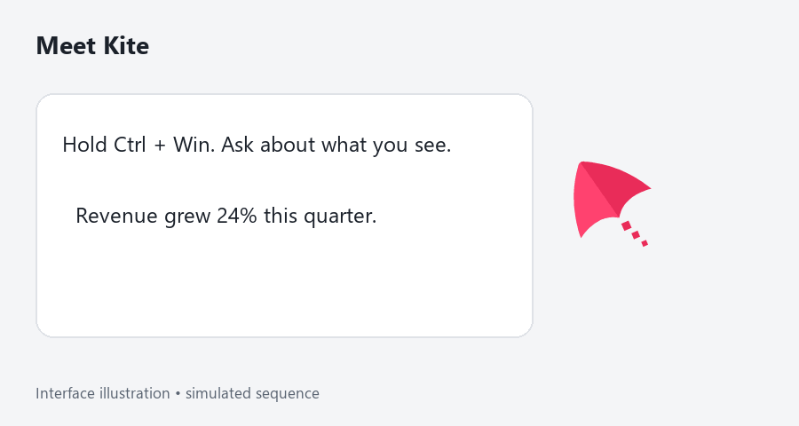
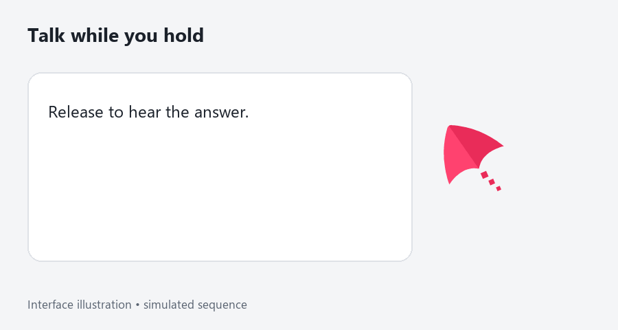
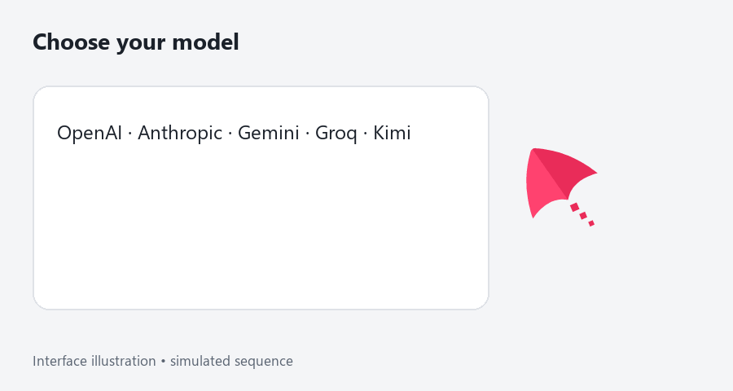
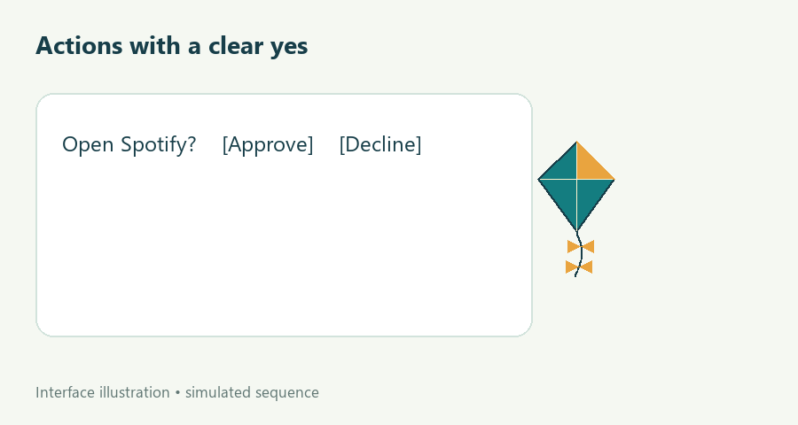
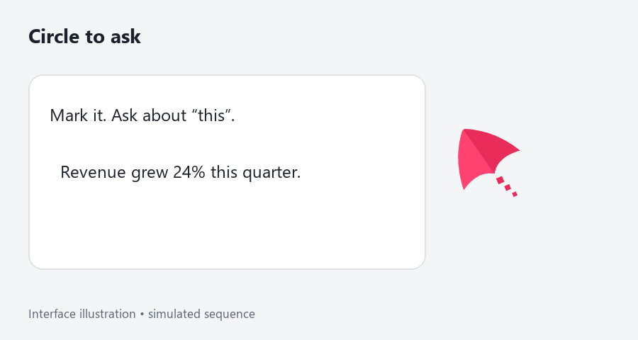
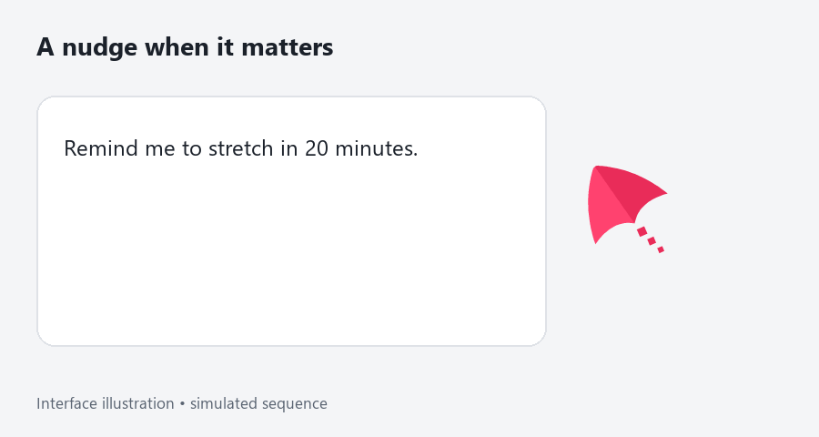

# Kite

**A little company beside your cursor. Hold to talk, or circle anything on screen and ask.**



The GIFs are labeled interface illustrations with simulated answers, not live model recordings. [Demo recording script](docs/demo.md).

## Windows download

[Releases and installers](https://github.com/Dheeraj-Manwani/kite/releases) · [Architecture](docs/architecture.md) · [Decision records](docs/adr/README.md)

Download `KiteSetup.exe` from a published release when available. Drafts are visible only to collaborators. The installer is **unsigned**: Windows may show **Unknown publisher**. After verifying the download came from this repository, choose **More info → Run anyway**. Managed Windows devices may block unsigned apps. No signing key is included.

First launch opens seven steps: welcome, a local microphone meter, provider keys, shortcut practice, a first question, circle practice, and preferences. Groq is required for transcription; add at least one model provider. Cartesia is optional for speech. Each key has a Test button. Startup launch defaults off. Replay the tutorial from the tray.

## Features

### Voice chat



Hold **Ctrl + Win**, speak, then release. A new hold interrupts playback. Escape cancels; short taps and silence do not call the model. Cartesia streams speech while the answer arrives, revealing words in time with playback. Text replies work without Cartesia. Microphone tracks are disabled and their AudioContext suspended between holds.

### Your choice of model



Bring keys for OpenAI, Anthropic, Google, Groq, or Moonshot. Switch models in Settings or the tray. Image turns route to a configured vision model when needed, and the bubble names the model used. Missing compatible keys produce a settings prompt. Availability depends on your account. This implementation uses **AI SDK 7**, with adapters in main.

### Actions with confirmation



Open Start Menu apps, search, create notes, paste, and use the clipboard through validated tools. Code generates confirmation summaries from validated arguments. Approve by click or voice. `type_text`, `read_clipboard`, `write_clipboard`, `read_screen`, `show_me_how`, and `do_task` **always ask**. Only open-app, web-search, date/time, and reminder-listing trust can be changed. For pasting, focus the destination first and use voice approval.

### Show me how

Ask “how do I add a footer in Word?” Kite plans the clicks and shows them for approval. Then the kite flies to each control, points at it with a hand-drawn ring, and speaks the step; click it yourself and Kite moves on. Say “wait”, “continue”, “next”, “back”, “repeat”, or “stop” anytime. Kite finds controls with Windows UI Automation on your PC and falls back to your vision model only when it can't. **It never clicks for you.** [Guide details](docs/guide.md).

### Explain it on a whiteboard

Ask Kite to explain something (“how does a TCP handshake work?”) and it opens a whiteboard. It sketches the idea in Excalidraw-style shapes, arrows, and handwriting one beat at a time while it narrates, and the kite holds the marker. Say “pause”, “next”, “replay”, or “close the board”; ask a follow-up and Kite adds to the same board; circle part of it while holding the shortcut to ask about that part. Copy or save the board as a PNG. [Whiteboard details](docs/whiteboard.md).

### Do it for me

Ask “write a shopping list in Notepad and save it as list.txt” and approve the task. Kite opens the app if needed and works through it step by step, clicking, selecting, and typing through Windows UI Automation and the keyboard. **It never moves your mouse pointer.** A card shows each step and a Stop button; the kite points at every control before using it. Anything that sends, deletes, buys, or submits asks again, even in an approved task. Touching your mouse or keyboard pauses it, and it stops after 15 steps. [Task details](docs/agent.md).

### Background agents

Open **Agents** from the tray or sidebar to save helpers and start background runs. Convert text/Markdown source and supported PNG/JPEG images to PDF, or losslessly optimize plain PDFs. Batch inputs, preview, reveal, export, and before/after size reports are available. Size targets can remain unmet; originals are never overwritten. Read-only Gmail Inbox Briefings add local source excerpts, PDF output and optional attachment downloads; this development integration requires your own Google Desktop OAuth client. Runs restore progress and requests after reopening and pause when Kite quits or sleeps. Career Scout discovers Greenhouse/Lever jobs, creates shortlist PDFs, and stages approved resume/contact inputs in an isolated browser for manual review and submission. Live ATS compatibility remains a release gate. Schedules run approved recurring Gmail/job-board checks, coalesce missed occurrences and keep unchanged results quiet. Career board tasks share concurrency, byte and deadline limits. Office, automatic submission and always-on hosting remain future work. [Background agent details](docs/background-agents.md) · [Gmail setup](docs/mail-agents.md) · [Career Scout guide](docs/career-agents.md) · [Schedules guide](docs/scheduled-agents.md).

### Circle to ask



Hold the shortcut, wait for the crosshair, and circle, underline, point, or tap while asking. Up to five strokes identify what “this” means. The model receives a marked overview and zoom; old images leave rolling context after the turn. A visible **Kite is looking** indicator and flash accompany every capture. Asking without drawing uses confirmed `read_screen`. [Capture details](docs/vision.md).

### Reminders and history



Reminders survive restart; overdue ones fire when Kite opens. Kite must be running to deliver them. History groups conversations by day, searches with SQLite FTS5, and shows models, annotations, tool decisions, and timing. Export Markdown, delete a conversation, or clear history with confirmation.

The tray offers pause for 15 minutes, an hour, or until restart; mute; logs; and problem reporting. Hotkeys accept two or more modifiers. Reduced motion follows Windows and has a manual override. Use **Keyboard controls** in the bubble to focus its buttons, then Tab through them.

## Measured performance

On the measured workstation: **0.66% idle CPU, 430 MB process working set, 60 fps while moving**. See [measurement results](docs/performance/README.md) and [raw samples](docs/performance/latest.json). These describe this workstation and method, not guaranteed performance. Voice-to-voice latency is **not yet measured with live providers**. The dev panel computes the median of non-interrupted SQLite samples after real interactions: key release to playback acknowledgement, not acoustic latency.

Cursor polling changes from 16 ms while moving to 100 ms after two stationary seconds. Dozing physics updates reduce to about 20 fps. Settings are destroyed on close; annotation, image preparation, history, and settings views load lazily. The renderer smoke test exercises 50 playback interactions and checks AudioContext reuse.

## Security and privacy

- Keys use Windows DPAPI through Electron `safeStorage`. Saved keys never return to a renderer; newly entered keys cross preload once to main. No plaintext fallback exists.
- Provider calls go directly from main to chosen services. There is no Kite backend or telemetry. Transcripts, selected screen content, and relevant tool context go to those providers.
- SQLite history and audits are **local plaintext** and may contain sensitive text. Raw audio is not saved. Screenshots stay in memory by default; optional history saves JPEGs in `userData/screens/`. Deletion removes associated files and search records; backups may retain copies.
- Background run payloads use OS encryption in a separate database. Generated PDFs and exported copies are ordinary unencrypted files; agent work has no retention/delete UI yet. The text-to-PDF workflow stays local and never overwrites sources.
- Capture protection and overlay hiding are enabled briefly and restored in `finally`. Protection stays off during normal use so recordings can show Kite. Verify exclusion on your Windows/capture setup.
- Guide mode reads control names and positions locally through a read-only UI Automation sidecar (inbox Windows PowerShell). It has no way to click, type, or invoke controls. Screens leave the PC only for an approved guide's vision fallback, with the capture indicator shown.
- Tasks use a separate sidecar, started only for an approved task. It acts through UI Automation patterns and keyboard input to the task's own window, and has no mouse code. The task's control names and values (never password fields) go to your model while it runs; risky steps always ask; every step is audited.
- Tools do not execute arbitrary shell commands. Main validates input and IPC sender/frame. Navigation and new windows are denied. Audio permissions are restricted to Kite recording/tutorial windows.
- Logs contain event names, numeric timings/counts, and constrained error codes, never keys, transcripts, screenshots, or raw exception messages. Logs rotate at 5 MB with two archives. Problem reports include version and OS only.

## Development

Windows x64, Node.js 22+, npm, and Windows C++ build tools for native rebuild:

```sh
npm ci
npm start
```

```sh
npm run lint
npm run typecheck
npm run test:unit
npm test
npm run make
npm run test:packaged
npm run test:native
npm run test:renderer
npm run test:startup
npm run test:uia
npm run test:agent
npm run perf
```

Run renderer/startup checks after the build completes. `npm run test:uia` opens a small WinForms window and walks a real guide through it with the UI Automation sidecar. `npm run test:agent` operates another WinForms window through the task sidecar and checks that the pointer never moves. Tests use temporary profiles and mocked or disabled provider traffic. `npm run perf` runs a roughly one-minute measurement and rewrites the raw report. Ctrl + Shift + D opens the development panel.

Forge uses one runtime-module list for Vite externals and copying production dependencies. Native modules are force-rebuilt for Electron and unpacked from ASAR. `Kite.exe --smoke-test` opens SQLite, starts/stops uiohook, writes `ok`, and exits. CI tests the packaged executable.

`npm run make` produces Squirrel and ZIP artifacts in `out/make`. A pushed `v*` tag matching `package.json` runs the draft GitHub publisher. Auto-update requires public releases; drafts do not reach users. Kite checks hourly, shows a tray badge/reaction when downloaded, and restarts when selected. [Release verification](docs/releasing.md).

Signing can later use `WINDOWS_CERTIFICATE_FILE` and `WINDOWS_CERTIFICATE_PASSWORD`; never commit either secret. CI builds unsigned artifacts. Reproduce artwork with `npm run assets` (Python plus Pillow); SVG source is included.

## Limitations and roadmap

Windows only, unsigned, no mouse automation (tasks use UI Automation and the keyboard). Voice intelligence requires provider accounts and network access. Live provider quality, mixed-DPI alignment, clean-machine installation, and upgrading an installed old version need manual checks. A packaged smoke test alone does not establish them. CI configuration is included; check GitHub for actual remote results.

Guide mode plans from the model's knowledge of each app; unusual labels rely on the vision fallback or “skip”. Mixed-DPI guide alignment and live Office/Chromium walkthroughs need manual checks.

Tasks and whiteboard lessons are only as good as your model's plan; apps with poor accessibility give tasks less to work with, and elevated windows can't receive their keys. Live Office, Chromium, and UWP tasks need manual checks.

Planned: a Rive renderer behind the existing rendering boundary. [Architecture](docs/architecture.md) · [Thirteen ADRs](docs/adr/README.md) · [Demo script](docs/demo.md).
