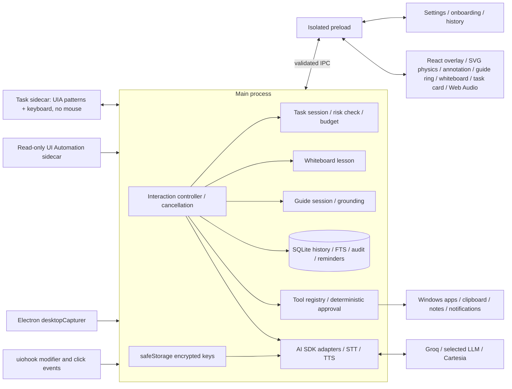

# Architecture

Kite keeps credentials, provider traffic, capture, persistence, and OS actions in main. The overlay renders motion and plays audio. A narrow preload bridge exposes typed operations, with sender/frame validation repeated in main. Settings, onboarding, and history share a separate window that is destroyed on close.



```mermaid
sequenceDiagram
  participant User
  participant Main
  participant Renderer
  participant Groq
  participant LLM
  participant Cartesia
  User->>Main: Hold modifiers
  Main->>Renderer: Start recording; capture then allow annotation
  User->>Main: Release modifiers
  Main->>Renderer: Stop recording / restore click-through
  Renderer->>Main: WebM audio + strokes
  Main->>Groq: Batch transcription
  Groq-->>Main: Transcript
  Main->>LLM: Text + marked overview/zoom when present
  loop Stream
    LLM-->>Main: Text delta or tool proposal
    Main-->>Renderer: Text / approval summary
    opt Tool needs approval
      User->>Main: Click or voice decision
      Main->>LLM: Validated tool result
    end
    Main->>Cartesia: Speakable sentence chunks
    Cartesia-->>Main: PCM + word timestamps
    Main-->>Renderer: Queue audio + karaoke timing
  end
  Renderer-->>Main: Playback start / finish acknowledgements
  Main->>Main: Persist actual model + metrics; replace context images
```

The pure PTT machine defines modifier ordering, repeats, cancellation, and minimum hold. The controller owns each interaction's abort signal; stale callbacks cannot affect a newer turn. Tool execution is serialized so interrupted clipboard operations restore state before a subsequent action starts. Voice approval is a child interaction and resumes its parent.

Annotation geometry stays in desktop DIP coordinates, including negative monitor origins. Pure mapping functions convert to captured pixels. The renderer lazily composes overview/zoom JPEGs using OffscreenCanvas. Main gates capture with an unavoidable indicator and restores temporary content protection even on failure. Completed image turns replace binary context with a text placeholder.

SQLite migrations create history, tool audit, screenshot attachments, and FTS5 with synchronization triggers. History deletion removes dependent records and attached images, resets rolling memory, and checkpoints WAL. Provider keys live separately as safeStorage ciphertext. Capture files are opt-in, except the explicit development test-capture action.

Guide mode (`src/main/guide`, [ADR 011](adr/011-guide-mode.md), [details](guide.md)) is a session state machine fed by one approved `show_me_how` plan. Each step is grounded by a read-only UI Automation sidecar (Windows PowerShell hosting C#, JSON lines over stdio, physical pixels converted to DIP). Matching lives in pure TypeScript. Vision is a fallback whose box is snapped back to the accessibility tree. uiohook mouse-downs inside the target advance the session; other input schedules quiet re-checks. A generation counter drops stale grounding after pause, stop, or step changes. Step lines are spoken as quiet announcements: they never talk over the user, and the latest line waits for the current interaction. Guide commands ("wait", "next", …) are answered locally without a model call. The overlay draws the ring and card and places the kite with a pure layout function; the frame loop springs the kite to its anchor and points the nose at the control.

The whiteboard (`src/main/board`, `src/renderer/board`, [ADR 013](adr/013-whiteboard.md), [details](whiteboard.md)) plays one `explain_on_whiteboard` script of beats. Shared pure layout (`src/shared/board.ts`) sizes shapes, binds arrows, and describes the board back to the model. Each beat is a quiet announcement with start/end hooks: drawing starts when its audio starts, and the next beat waits for both speech and the overlay's drawn acknowledgement (with a timeout). The overlay renders seeded rough.js-style strokes, and a player inside the frame loop traces them and reports the pen nib, which the kite springs to. Marks drawn on the board name its elements instead of taking a screenshot. `src/shared/boardMetrics.ts` lints a laid-out board (collisions, overflow, edges through shapes, on-screen text size); the board service attaches those counts, the time to first stroke, and token use to each view for the dev panel, and `scripts/board-eval.cjs` scores lessons from each provider with it.

Tasks (`src/main/agent`, [ADR 012](adr/012-computer-use.md), [details](agent.md)) start from one approved `do_task` call whose approval carries a scope (whole task or step by step). A task session loops: snapshot the app through a separate task sidecar, ask the model for exactly one validated action, run a deterministic risk check, confirm when needed, point the kite, and act through UI Automation patterns or keyboard `SendInput` to the task's own window. The task sidecar has no mouse code. Pausing aborts the step in flight, and uiohook input outside Kite (ignoring Kite's own injected keys) pauses the task. Guide, whiteboard, and task voice commands are answered locally, in that order of precedence: task, then whiteboard, then guide.

The imperative motion loop avoids React updates on every frame. Cursor samples live outside React; the loop drives spring physics, SVG transforms, microphone/playback levels, and bubble positioning. Moving animation runs at display cadence; dozing physics throttles to about 20 fps. Heavy views and image preparation are lazy-loaded.

Forge's shared external list is also the root of its production-dependency copier. Native rebuild targets the packaged Electron ABI, and the native-unpack plugin keeps `.node` files outside ASAR. The packaged smoke path opens a temporary SQLite database and starts/stops the hook without loading provider credentials.
