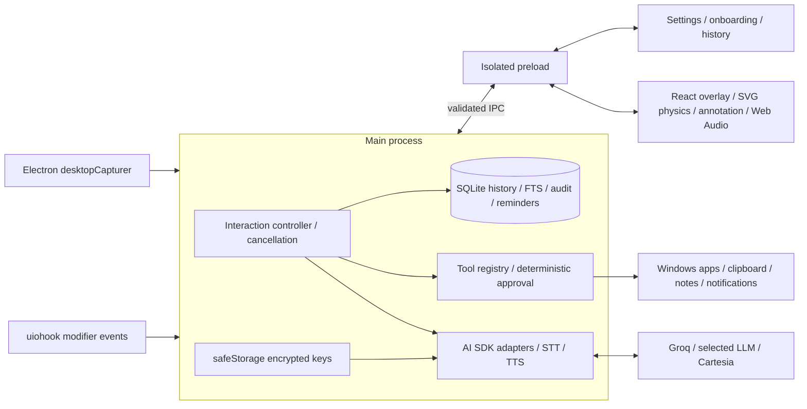

# Architecture

Kite keeps credentials, provider traffic, capture, persistence, and OS actions in main. The overlay renders motion and plays audio. A narrow preload bridge exposes typed operations, with sender/frame validation repeated in main. Settings, onboarding, and history share a separate window that is destroyed on close.



```mermaid
sequenceDiagram
  participant User
  participant Main
  participant Renderer
  participant Groq
  participant LLM
  participant Cartesia
  User->>Main: Hold modifiers
  Main->>Renderer: Start recording; capture then allow annotation
  User->>Main: Release modifiers
  Main->>Renderer: Stop recording / restore click-through
  Renderer->>Main: WebM audio + strokes
  Main->>Groq: Batch transcription
  Groq-->>Main: Transcript
  Main->>LLM: Text + marked overview/zoom when present
  loop Stream
    LLM-->>Main: Text delta or tool proposal
    Main-->>Renderer: Text / approval summary
    opt Tool needs approval
      User->>Main: Click or voice decision
      Main->>LLM: Validated tool result
    end
    Main->>Cartesia: Speakable sentence chunks
    Cartesia-->>Main: PCM + word timestamps
    Main-->>Renderer: Queue audio + karaoke timing
  end
  Renderer-->>Main: Playback start / finish acknowledgements
  Main->>Main: Persist actual model + metrics; replace context images
```

The pure PTT machine defines modifier ordering, repeats, cancellation, and minimum hold. The controller owns each interaction's abort signal; stale callbacks cannot affect a newer turn. Tool execution is serialized so interrupted clipboard operations restore state before a subsequent action starts. Voice approval is a child interaction and resumes its parent.

Annotation geometry stays in desktop DIP coordinates, including negative monitor origins. Pure mapping functions convert to captured pixels. The renderer lazily composes overview/zoom JPEGs using OffscreenCanvas. Main gates capture with an unavoidable indicator and restores temporary content protection even on failure. Completed image turns replace binary context with a text placeholder.

SQLite migrations create history, tool audit, screenshot attachments, and FTS5 with synchronization triggers. History deletion removes dependent records and attached images, resets rolling memory, and checkpoints WAL. Provider keys live separately as safeStorage ciphertext. Capture files are opt-in, except the explicit development test-capture action.

The imperative motion loop avoids React updates on every frame. Cursor samples live outside React; the loop drives spring physics, SVG transforms, microphone/playback levels, and bubble positioning. Moving animation runs at display cadence; dozing physics throttles to about 20 fps. Heavy views and image preparation are lazy-loaded.

Forge's shared external list is also the root of its production-dependency copier. Native rebuild targets the packaged Electron ABI, and the native-unpack plugin keeps `.node` files outside ASAR. The packaged smoke path opens a temporary SQLite database and starts/stops the hook without loading provider credentials.
