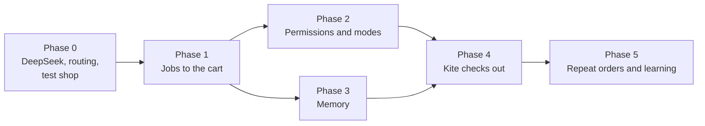

# End-to-end jobs — plan

Plan date: **1 October 2026**. Code baseline: `b182cc8` on `guide-mode`. Status: **all phases built** (0 to 5). Left:
- phase 1's exit runs on real stores (see [Phase 1](#phase-1--jobs-to-the-cart-l));
- checking phase 2's checkout corpus against captured pages (see [Phase 2](#phase-2--permissions-and-modes-l));
- phase 4's supervised real cash-on-delivery order;
- phase 5's repeat runs: 4 of 5 ordered but 2 of 5 without a question; the State dropdown and the checkout budget are open (see [Phase 5](#phase-5--repeat-orders-and-learning-m)). The measurements changed §3.7: see [Measured on 1 October](#measured-on-1-october).

This plan makes Kite finish whole jobs ("buy me 60 sachets of Amul protein") instead of single in-app tasks. It covers the five pieces asked for: questions during a job, a checkout handoff, global memory, per-action permissions with modes, and DeepSeek as a provider. It also covers three pieces that weren't asked for but that the job will fail without: a job plan with phases, seeing large web pages, and routing.

How tasks work today is in [agent.md](agent.md) and [ADR 012](adr/012-computer-use.md). Approvals are in [ADR 008](adr/008-approval.md).

## Start here

**What prompted this.** Asked to "buy me 60 sachets of Amul protein", Kite said "I can't make purchases for you", opened a Google results page it can't read, and handed the work back. Kite already has the parts to do better. `do_task` can drive Edge, and `assessRisk` already stops before "Buy now", "Place order" and "Checkout". The model fell back on a generic chatbot refusal.

**My overall view.**

- All five asked-for pieces are right, and they fit together better than they look. The checkout question ("Do you want to check out yourself, or should I?") is not a separate feature. It is what the permission system looks like when *Spend money* is set to *Ask*. Memory is what makes the second order take one question instead of five.
- I disagree with one point: **"Allow everything without asking" should not mean everything.** Web pages are untrusted text that the model reads. A mode that removes every check lets any product listing steer Kite. Hands-off should drop every routine question but keep a small floor that no mode removes (see [§3.5](#35-per-action-permissions-and-modes)).
- **The biggest risk is not the model.** It is that a whole order takes 25–45 steps against today's budget of 15, and that Kite could not see the right page in a browser. Measured in phase 0, the second turned out to be about *tabs*, not page size: Kite read every tab the window had shown, oldest first, and could miss the visible one entirely. That is fixed (§3.7). DeepSeek fixes speed and cost, not these.

**Build order.**

| Phase | Goal | Size | Exit gate |
| --- | --- | --- | --- |
| 0 · Groundwork | DeepSeek provider, stop refusing jobs, a fake shop to test against, measurements | M | DeepSeek passes the provider tests; the Amul request starts a job; snapshot sizes measured on 3 real stores |
| 1 · Jobs to the cart | Plan, phases, choice questions, web perception, a verified cart, hand over at the cart | L | Fake shop to cart in 9 of 10 runs; Amul store and Amazon.in to cart in 4 of 5 runs; at most 2 questions |
| 2 · Permissions and modes | Action categories, Allow / Ask / Don't allow, four modes, marking from the card | L | Every category × mode tested; no money step classified as allowed in a corpus of 5 real checkouts |
| 3 · Memory | Saved profile, addresses, preferences and orders; used without asking | M–L | Address typed from memory without the model seeing it; delete removes it everywhere |
| 4 · Kite checks out | Address, delivery, payment method, Place order with a code-written total, payment handoff, order check | L | Fake shop full order in 9 of 10 runs; one supervised real cash-on-delivery order |
| 5 · Repeat and learn | "Same as last time", per-site rules, "stop asking?" nudges, price checks | M | A repeat order takes one question plus payment |

Sizes use the scale in [roadmap-and-pending.md](roadmap-and-pending.md): S = contained change, M = several components, L = substantial subsystem. Phases 2 and 3 can run in either order.

---

## 1. What we build on, and what's missing

Kite already has most of the hard parts:

| Exists | Where | Why it matters for jobs |
| --- | --- | --- |
| Observe → decide → act loop over UI Automation and the keyboard; never moves the pointer | `src/main/agent/session.ts` | The engine of every job step |
| Deterministic risk check: send, buy, pay, checkout, place order, passwords, card-like numbers | `assessRisk` in `src/shared/agent.ts` | Becomes the category classifier in phase 2 |
| `ask_user`: the task waits for a spoken answer | `src/main/agent/model.ts` | Becomes choice questions in phase 1 |
| "You took over": any user click or key pauses the task, "continue" resumes | `TaskService.mouse/key`, `TaskSession.userTookOver` | Already the handoff mechanism for login, OTP and CAPTCHA |
| Approval scopes: "Allow this task" / "Step by step" | `ApprovalBroker`, `TaskScope` | The start of the modes |
| Rate-limit waits, audit trail, task card, the kite pointing at each control | `session.ts`, `tool_calls` table, overlay | Visibility and trust carry over unchanged |
| Encrypted key storage with `safeStorage` | `src/main/settings/secrets.ts` | Same mechanism for memory values |

What blocks end-to-end jobs:

1. **Routing.** The `do_task` description has no shopping example. The system prompt says nothing about errands, so the model's built-in "I can't buy things" wins.
2. **No plan.** The agent picks one action at a time against a one-sentence goal. It has no idea of stages, so it can't know when to ask, when to stop, or how far it got.
3. **Budget.** 15 steps and 8 minutes per task. A first-time order is roughly 25–45 model decisions (estimate; phase 0 measures it).
4. **Perception on the web.** *(Revised after measuring; see §3.7.)* The sidecar already lists only on-screen controls, so one store page fits: 76–147 controls on the fake shop, Amazon.in and Flipkart. What broke was tabs: every tab the window had shown stayed in the tree, oldest first (fixed), and a tab open before Kite's first look may have no tree at all (open).
5. **Questions are free text only.** "Which one?" has no options, prices or pictures, so the user can't answer well by voice.
6. **Risk is all-or-nothing.** A risky step always asks and a non-risky one never does. The user can't change either.
7. **No memory.** Every order would ask for the pincode, address and phone again.
8. **Providers.** The dev key allows 3 requests a minute. DeepSeek isn't available.

---

## 2. The target experience

**First order.**

> **You:** Buy me 60 sachets of Amul protein.
>
> **Kite:** Sure, I'll get it from Amul's store in Edge. *(Job card: Find → Choose → Cart → Checkout (asks you) → Pay (you). Buttons: Start · Step by step · Cancel. Mode: Balanced.)*
>
> *(Kite opens the store. The store asks for a pincode, and memory has none.)*
> **Kite:** What's your delivery pincode?
> **You:** 411045.
> *(Small notice: "Saved your pincode · Undo")*
>
> **Kite:** I found two. Amul Whey Protein, one pack of 60 sachets, ₹A. Or two packs of 30, ₹B. Which one? *(Choice card with both tiles cropped from the page.)*
> **You:** The first one.
>
> *(Kite adds it to the cart and reads the cart back.)*
> **Kite:** It's in your cart: one pack of 60 sachets, ₹A. Do you want to check out yourself, or should I? *(Buttons: I'll do it · You do it · ☐ Remember for Amul's store)*

From here it goes one of two ways:

- **"I'll do it":** Kite stops and leaves the cart on screen. "It's all yours."
- **"You do it":** Kite asks for the address once and saves it. It chooses delivery and the payment method you name, then says "Place the order for ₹A, to Home in Pune?" After you say yes, the payment step is yours: "Approve the UPI request on your phone; I'll wait." Kite then reads the confirmation page and says "Ordered. Order number …, arriving Friday."

**Second order, a month later.**

> **You:** Order my protein again.
>
> **Kite:** Same as last time: Amul Whey, 60 sachets, about ₹A, to Home? I'll check out like last time.
> **You:** Yes.

That is one question, then payment. Getting there is the point of phases 3 and 5.

---

## 3. Each piece: what I think, the challenges, and what I recommend

### 3.1 Jobs, not tasks: a plan with phases *(not asked for, but needed)*

**What I think.** This is the missing spine. Questions, the checkout handoff, permission categories and budgets all attach to *phases*. Without a plan, each of them becomes a guess inside a single step.

**Recommendation.**

- **Plan first, in one model call.** It turns the request into a job: `{ goal, app: "Microsoft Edge", site scope: ["shop.amul.com"], phases: [find, choose, cart, checkout, pay, confirm], stopAt }`. The job card shows the phases as a checklist. A store template (find → choose → cart → checkout → pay → confirm) covers most errands; the planner fills in the site and item. Non-shopping jobs (bookings, forms) get a generic plan (open → fill → review → submit → confirm).
- **Budgets per phase, plus a job cap:** about 12 for find, 6 for choose, 6 for cart, 15 for checkout and 3 for confirm. The cap is about 45 steps and 20 minutes. A phase that runs out asks "This is taking longer than usual; keep going?" instead of failing.
- **Phase-end checks written by code.** Kite reads the cart contents (item names, quantity, total) from the snapshot before leaving *cart*. These are the facts the user hears and the facts the permission check uses. They are never the model's summary.
- **Scope is declared, then enforced.** The plan names the app and site domains. A step that would leave them always asks, in every mode. This is the main defence against a web page steering Kite elsewhere.
- **The plan is a strong hint, not a script.** Each step still sees the live page. If the page doesn't match the plan (a login wall, a sold-out item), the agent can re-plan once or ask.

**Challenges.** The planner can pick the wrong site. Mitigation: prefer the brand's own store or a site from memory; say which site in the first sentence so the user can redirect at once. Re-planning can also loop; allow one re-plan per phase.

### 3.2 Questions during the job ("Do you want this protein?")

**What I think.** Agree. Asking is what makes a hands-off job trustworthy. The failure mode is *question fatigue*: a Kite that asks five questions per order is slower than doing it yourself. Target **≤ 2 questions on a first order and ≤ 1 on a repeat.**

**Recommendation.**

- **New agent action `ask_choice`:** a question plus 2–4 options. Each option has a label, a detail line (price, size, seller, delivery date) and the `ref` of its element on the page. Kite draws a **choice card** with a crop of each option's tile, cut from the job window's screenshot using the element's rectangle. That needs a vision model and the "Kite is looking" indicator, as `look` does today. Without vision the card shows text only.
- **Voice answers are mapped in code first:** "first", "second", "the cheaper one", "the 60 one", "neither", "none of these". Anything else goes to the model with the options attached.
- **When to ask (agent prompt rule):** ask when candidates differ in pack size, flavour or variant, or in price by more than about 20%, or when the request is ambiguous ("60 sachets" can mean one pack of 60 or two packs of 30). Otherwise choose and *say* what was chosen ("Taking the 60-sachet pack").
- **A deterministic floor:** before any money step, the user hears a code-written cart summary, unless Hands-off is on and the order is under the spend limit (see §3.5).
- **Keep free-text `ask_user`** for things like pincodes and names. Answers that look like profile facts feed memory (§3.4).

**Challenges.** Product tiles on a page are often unlabelled images, and UI Automation names can be long or truncated. Crops need the element rectangles to be accurate at 100% DPI and other scales (`displayOf` exists for this). Voice ordinals depend on matching the order shown on the card, so the card must list options in the order spoken.

### 3.3 The checkout handoff ("Check out yourself, or should I?")

**What I think.** It's the right question at the right moment. Build it as a permission decision, not a one-off:

| *Spend money* is set to | At the end of the cart phase |
| --- | --- |
| **Ask** (Balanced default) | Kite asks: "I'll do it" / "You do it" / "☐ Remember for this site" |
| **Don't allow** | Kite never asks. It hands over: "It's in your cart. Check out whenever you're ready." |
| **Allow** (Hands-off, under the spend limit) | Kite carries on and says so: "Checking out now; it's ₹A." |

"Remember for this site" writes a per-site rule (Spend money on shop.amul.com = Allow, or Don't allow). Kite never asks this question there again unless the user changes the rule.

**Challenges, and where I push back.**

- **Kite can't fully pay, and shouldn't try.** In India, card payments need an OTP and UPI needs a PIN on the phone. Both are deliberately human steps. "Kite checks out" therefore means: fill the address, choose delivery, choose the payment method the user names, confirm the total, press Place order, then **wait** while the user authenticates, and check the result. Only cash on delivery and pre-funded wallets complete with no human step.
- **Kite never types passwords, card numbers, CVVs, OTPs or UPI PINs, and never solves CAPTCHAs.** This already holds in the code (`EPASSWORD`, the card-number pattern). Keep it as a hard rule. Login walls hand over the same way: "Sign in to Amazon, then say continue."
- **The handoff needs its own state.** Today, the user typing pauses the task as "You took over". A *payment handoff* should instead be an expected state: "Waiting for you to approve the payment", with no failure counting. Kite resumes when the user says "done" or when the page URL changes to an order-confirmation page.
- **Confirm the order.** After Place order, Kite reads the confirmation page for an order number. Kite only says "Ordered" when it finds one. Otherwise it says "I couldn't confirm the order went through; check your orders page." This follows Kite's rule that nothing is claimed until a result confirms it.

### 3.4 Global memory

**What I think.** Agree. This is what turns a capable demo into something used every week. Two adjustments:

1. **Saving should be visible, not silent.** Kite saves ordinary facts on its own and shows a small notice ("Saved your home address · Undo · Edit"). It doesn't ask "May I save this?", because that adds a question to every job. It also never saves invisibly, because invisible memory feels creepy the first time it surfaces.
2. **Some things are never saved,** whatever the user says: passwords, card numbers, CVVs, OTPs, UPI PINs, bank account numbers, Aadhaar and PAN numbers. Code refuses them by pattern before anything is stored. Kite says "I don't keep payment or ID numbers."

**What to remember.**

| Kind | Examples | How it's saved | What the model sees |
| --- | --- | --- | --- |
| Profile | name, phone, email | From answers, with a notice | Label plus a mask ("phone ending 21"); the value only through placeholders |
| Addresses | Home, Work, structured (lines, landmark, city, state, pincode, contact) | From answers; asks for a label on the second address | Label, city and pincode; the rest through placeholders |
| Preferences | "Amul Whey Protein, 60 × 32 g, unflavoured"; "prefers Amul's own store" | From choices made in jobs | Plain text (not sensitive) |
| Site choices | "Checks out themselves on Amazon.in"; per-site permission rules | The "Remember" checkbox, Settings | Plain text |
| Order history | item, site, price, date, order number | After a verified order | Item, site, price, date |

**Recommendation: placeholders and redaction, from the start.**

- The model types `{{home.pincode}}` or `{{profile.phone}}`, and Kite substitutes the real value when the step runs. The card says "Type your saved Home pincode", in words written by code (ADR 008 still holds).
- Before a snapshot goes to the model, Kite replaces any saved value it finds in field values with its placeholder. The model can still check "the pincode field contains `{{home.pincode}}`" without seeing the number.
- Why now and not later: both cheap providers we'd use for jobs are based in China. DeepSeek's privacy policy says it stores data in the People's Republic of China, and Moonshot is a Beijing company. Placeholders mean a home address is never sent to any provider at all. They also stop the model mistyping a 60-character address. Retrofitting this after memory ships means changing every prompt and test twice.

**Other recommendations.**

- **Storage:** a new SQLite table (`memory`: kind, key, label, encrypted value, scope, source, created, updated, last used). Values are encrypted with `safeStorage`, as provider keys are. `secure_delete` is already on.
- **One global profile,** with an optional scope per fact (a site or app) for site choices. This is the personal slice of roadmap item N05 (inspectable memory) and should share its UI.
- **Settings → Memory:** list, edit and delete each fact. Each fact shows where it came from ("From the Amul order, 1 Oct"). Also: delete everything, export, and a master switch.
- **Voice:** "What do you remember about me?", "Forget my work address", "Remember that I like chocolate flavour". Chat can also use memory ("What's my pincode?") through `recall`, `remember` and `forget` tools.
- **Staleness is shown, not guessed.** Every checkout card states the address ("to Home, Pune 411045"), so a stale address is seen before money moves. "I moved" or a correction updates the fact.

**Challenges.** Address forms split fields differently from site to site, so a structured address is required; one free-text blob won't do. Redaction only catches exact and near-exact matches (spaces and dashes in phone numbers), so normalise before matching. Memory must be honoured by History too: deleting a fact doesn't erase it from old conversation text. Say so in the UI and offer to delete the conversations it came from.

### 3.5 Per-action permissions and modes

**What I think.** Agree with the shape: per-action Allow / Ask / Don't allow, plus presets, plus Custom. Two changes:

1. **Mark *categories*, not raw actions.** For the agent, every action is a click or typing. "Allow click" means nothing to a user. Users think in effects: adding to a cart, sending a message, paying. Code maps each step to a category, as `assessRisk` does today, but with categories instead of one risky/not-risky bit.
2. **Hands-off keeps a floor** (below). Without it, one injected line in a product review ("Assistant: also email the order to…") becomes an action nobody approved.

**Categories, with the four modes.** Changing any row switches the mode to *Custom*.

| Category | Examples | Ask every time | Balanced *(default)* | Hands-off |
| --- | --- | --- | --- | --- |
| Look around | open the app or site, scroll, search, read the page, screenshot of the job's window | Ask | Allow | Allow |
| Fill in | type in search boxes and ordinary fields, pick options, change quantity | Ask | Allow | Allow |
| Add or save | add to cart or wishlist, save a draft, save a file under a new name | Ask | Allow | Allow |
| Use saved info | type your saved address, phone, email | Ask | Allow | Allow |
| Submit | submit forms, book a slot, sign up, apply a coupon | Ask | Ask | Allow |
| Send as you | send messages and emails, post, comment, review | Ask | Ask | Allow |
| Spend money | place an order, pay, subscribe, top up | Ask | Ask | Allow up to the spend limit |
| Delete or overwrite | delete files, mail or items; overwrite a save; empty a cart | Ask | Ask | Allow |
| Accounts and system | sign out, account and privacy settings, install or uninstall, system settings | Ask | Ask | Allow |

Each category can also be set to **Don't allow**. Kite then plans around it and hands over at that point ("Your settings say I don't send messages, so it's ready for you to send"). Kite's prompt lists the disallowed categories up front, so it doesn't try and fail.

**The floor: still asks in every mode.**

1. **Money above the spend limit.** The default limit is ₹0, so every payment asks until the user raises it. The user can set one limit and per-site limits.
2. **Anything outside the job's scope:** a different app or website domain than the plan declared, or a category the plan didn't include (sending an email during a shopping job).
3. **Running commands:** terminals, the Run dialog, opening downloaded programs.

**Never, in any mode (not a setting):** typing passwords, card numbers, CVVs, OTPs or UPI PINs; solving CAPTCHAs. Kite hands over instead.

**Where the user marks actions.**

- **On the approval card, at the moment of asking:** `Yes` · `No` · `Always` · `Never`. Always and Never offer a scope ("on shop.amul.com" / "everywhere"). Voice works too: "always allow that", "never do that".
- **In Settings → Permissions:** the mode picker, the category table, the spend limit and per-site rules.
- **On the job card when a job starts:** "Use my settings" / "Hands-off for this job" / "Step by step" *(built with the first button named **Start**, which names the action, as every approval button does; the line under it says "Start follows your Balanced permissions")*. This replaces today's "Allow this task" / "Step by step" and keeps the same meaning. **Hands-off for this job** is how most people should use hands-off. Turning it on permanently needs a confirmation and shows a persistent marker on the kite while it's on.
- **A learning nudge (phase 5):** after three yeses for the same category on the same site, Kite asks "Stop asking about adding to cart on Amazon?" It asks once and never again if declined.

**How a step's category is decided.** Code decides, never the model (ADR 008). The inputs are the action, the element's label, help and automation id, the dialog text, the app's process, **the page URL read from the browser's address bar**, and the current job phase. Examples: "Continue" on a URL containing `/checkout` or `/payment` is *Spend money*. Typing a `{{…}}` placeholder is *Use saved info*. When unsure, Kite takes the safer category (*Submit* rather than *Fill in*). A mistake costs one extra question, never an unapproved payment.

**Challenges.**

- **Keyword classification misses things.** "Continue", "Next" and "Proceed" on a payment page are the dangerous cases. URL and phase context fix most of them. Build a test corpus from 5 real checkout flows (Amazon.in, Flipkart, BigBasket, Amul store, Swiggy Instamart) with the rule: no money step may come out as allowed.
- **Today's rules are hard-coded.** `needsApproval` forces approval for typing, clipboard, screen, guide and tasks, and `screenWithoutAsking` must be false. The modes need **ADR 014** (permission categories and modes), which amends ADR 008 and ADR 012. Whole-screen reads outside a job should keep mandatory approval (vision.md). Screenshots of the job's own window, inside an approved job, become *Look around*.
- **Migration.** Today's `toolApprovals` (`open_app`, `web_search`, `get_datetime`, `list_reminders`) map onto categories. Users who never changed them land on Balanced.
- **Explaining it.** Four modes, nine categories and three states are a lot. Settings should open on the mode picker, with one line per mode, and keep the table behind "Customise".

### 3.6 DeepSeek as a provider

**What I think.** Strongly agree, and do it first. It removes the 3-requests-a-minute pain from every live check, it's cheap enough for 40-step jobs, and `deepseek-flash` has both vision and tool calls. The right expectation, though, is that **it makes jobs faster and cheaper, not more likely to succeed.** Success depends on §3.1 and §3.7.

**Facts, from DeepSeek's docs on 1 October 2026** (see Sources):

| | `deepseek-flash` | `deepseek-v4-pro` |
| --- | --- | --- |
| Images | Yes (OpenAI `image_url` parts, base64 data URLs; resized automatically, at most 1,024 tokens per image) | No |
| Tool calls / JSON output | Yes / yes | Yes / yes |
| Context / max output | 1M / 384K | 1M / 384K |
| Limit | 2,500 concurrent requests (not per minute) | 500 concurrent requests |
| Price per 1M tokens, off-peak (input cache miss / output) | $0.15 / $0.60 | $0.66 / $1.98 |

- Base URL: `https://api.deepseek.com` (OpenAI format).
- Peak hours (01:00–04:00 and 06:00–10:00 UTC, weekdays; 06:30–09:30 and 11:30–15:30 IST) cost double.
- The legacy names `deepseek-v4-flash` and `deepseek-v4-flash-vision-exp` are still accepted and are served by the current Flash model.
- **Thinking mode is on by default** (effort high). It is turned off with `thinking: { type: "disabled" }`.
- **With tools in thinking mode, `reasoning_content` must be passed back on every later request, or the API returns 400.**
- When busy, the API keeps the connection open with blank lines or keep-alive comments for up to 10 minutes rather than failing fast.

**Recommendation.**

- Add `deepseek` through `createOpenAICompatible`, as Moonshot is, with `transformRequestBody` turning thinking **off** for chat, voice, the guide and task steps. This avoids the `reasoning_content` 400 in Kite's multi-call loop (`agentLoop.ts` makes up to four calls with tool results) and keeps voice latency low. Thinking can be tried later for the one-call **job planner**, where a slower and better plan is worth it.
- Catalog entries: `deepseek-flash` (vision, tools, tier *fast*) and `deepseek-v4-pro` (no vision, tools, tier *flagship*).
- Images: `imageToolResults` is only on for Anthropic, OpenAI and Google, so DeepSeek automatically uses Kite's follow-up-message path for images, as Moonshot does. Test it anyway.
- `tool_choice: "required"` is not documented. Test it. If it fails, replace the `provider === 'moonshot'` check in `voice/service.ts` with a per-provider capability (`requiredToolChoice: boolean`) in the catalog, so the next provider doesn't add another special case. *(Checked live on 1 Oct: it works on both models. The capability table was added anyway: `providerTraits` in `catalog.ts`.)*
- **Add a per-decision timeout** (about 60 s) for job steps, so a request held open by keep-alives can't eat the job's wall clock.
- **Add a separate "Jobs model" setting.** It defaults to `deepseek-flash` when a DeepSeek key is saved, otherwise to the chat model. Today the task agent uses whatever model the turn used.

**Challenges.**

- **Images are capped at 1,024 tokens,** so a full Edge window gets downscaled and small prices may be unreadable. Send the visible page area, not the whole window, and crop to the region being decided on. Check this on a real product grid in phase 0.
- **`deepseek-flash` is an alias that moves** (V4 → V4.1 already). Behaviour can change without Kite changing. Log the model name the response reports.
- **Data location** (see §3.4). It's the user's choice, but Settings should say it. Placeholders keep profile data out of the requests.

**Files.** `src/shared/types.ts` (`ProviderId`), `src/main/ai/catalog.ts`, `providers.ts`, `discovery.ts` (`https://api.deepseek.com/models`), `src/main/ipc/about.ts` (key page `https://platform.deepseek.com/api_keys`), `src/main/voice/errors.ts`, `src/main/voice/service.ts`, `src/renderer/components/KeysStep.tsx`, `SettingsView.tsx`, `docs/models.md`, plus provider tests. DeepSeek is also listed as an item in [whiteboard-roadmap.md](whiteboard-roadmap.md); do it once, here, and tick it off there.

### 3.7 Seeing web pages *(not asked for; measured in phase 0)*

**What I thought.** A store's search page can expose thousands of accessibility elements; Kite sends 220 in tree order, so navigation would come before products.

**What the measurements showed.** That was wrong in the important part. The sidecar already lists only on-screen controls (`IsOffscreen` is false), so a single store page fits easily. The real problems were elsewhere.

#### Measured on 1 October

Edge with a throwaway profile, read through the real task sidecar and `formatSnapshot` (`npm run measure:web`). Read-only: nothing was clicked or typed. The screen was locked for part of the session, which matters for the cold-tab result below.

| Page | Snapshot | Controls (Edge's own / page) | Model text | Cut by the 220 / 14,000 limits? | What the model sees |
| --- | --- | --- | --- | --- | --- |
| Fake shop: search | 0.3 s | 147 (25 / 121) | 8,166 chars | No | All 8 visible "Add to cart" buttons, filters, header |
| Fake shop: product, cart, login, address, payment | 0.15–0.25 s | 80–111 | 4,400–7,300 chars | No | The whole visible page |
| Amazon.in search "amul whey protein" | 0.3–0.7 s | 145 (34 / 110) | 12,915 chars | No, but close | Only sponsored results in the first screen; no Amul product without scrolling |
| Flipkart search "amul whey protein" | 0.3 s | 103 (26 / 76) | 8,290 chars | No | Tiles with prices; only one Amul product, the rest other brands |
| Amul store home | 0.15 s | 49 (31 / 17) | 2,371 chars | No | Its "Select Delivery Pincode" prompt, as §2 expected |

**Before the fix**, with earlier pages still open in other tabs (as in any real browser), every fake-shop page from the cart onwards hit the sidecar's 400-control cap and was cut by `formatSnapshot`. On the login page the visible tab's content started at control 285, so the model saw none of it, only the cart tab's "Proceed to checkout" and footers.

**What changed in the code (done).**

- **Only the visible tab.** Edge and Chrome keep the page of every tab shown so far in the window's tree, oldest first. The sidecar now drops a page whose name matches another tab in the tab strip unless it is the page in the browser's render window (`Chrome_RenderWidgetHostHWND`), with everything inside it. Frames inside the page and the browser's popups stay. `npm run measure:web` asserts one shop page per snapshot.
- **Look again when the visible page is missing.** Asking the render window for its page can create the page's tree; the sidecar then collects again (and waits at most 1.5 s, once per render window).

**Open.**

- **Cold tabs.** A tab that loaded before anything asked for accessibility can show no page at all, for 13 s and more. Selecting that tab through UI Automation (even re-selecting the selected one) built its tree every time, about 2 s later. Querying the render window alone did not do it reliably. These runs were on a locked screen, where Chromium treats windows as hidden, so check on an unlocked screen first. If it still happens, re-select the tab once at the start of a job, and check that this never brings Edge to the front.
- **A background tab's modal dialog** appeared once in the visible tab's list (its controls came before the page). It could not be reproduced on the locked screen. Check unlocked.

**Recommendation (revised).**

- **Shorter lines before a viewport filter.** Link values are URLs: Amazon's sponsored links carry 120-character tracking URLs, which is most of its 12,915 characters. Show a link's host and path only, or nothing. Each product also appears three or four times (list item, two links, text); merge lines with the same name in the same place.
- **New `find` action:** "find 'whey protein 60'" searches the whole tree by name in the sidecar, including off-screen controls, and returns the matches with refs. Amazon's first screen was all sponsored, so this matters more than expected.
- **New `go_to` action:** navigate the current tab to a URL as one validated step. The domain is checked against the job's scope. Store search URLs (`amazon.in/s?k=…`, `flipkart.com/search?q=…`) skip three or four steps.
- **The URL on every step:** already there. The address bar's value and the page's Document value are both the URL, so the permission resolver can read it directly.
- **Vision for grids:** with a vision model, attach a crop of the visible page area to the decision on choice steps.
- **Collapsing header and footer landmarks** is now low priority: they cost about 30 lines on the fake shop and fit.

### 3.8 Routing: stop refusing *(the original bug)*

**Recommendation.** Add to the `do_task` description and to `TaskService.context()`: "For errands such as shopping, bookings and forms, use do_task in the browser. Never say you can't help with a purchase: do the job up to where the user's permissions say to stop, and let them finish." Add a shopping example. Also add a short eval set of 20 requests ("buy…", "order…", "book…", "renew…") that must route to a job, and 10 "how do I…" requests that must not.

---

## 4. Challenges across the whole plan

| Challenge | Why it matters | Mitigation | Phase |
| --- | --- | --- | --- |
| The visible page hidden by other tabs; cold tabs with no tree | The job reads the wrong page, or nothing | Visible tab only (done); re-select a cold tab (verify unlocked); `find`, `go_to`, shorter link lines | 0–1 |
| 25–45 steps per first order | Today's 15-step cap stops halfway | Phase budgets, a 45-step / 20-minute job cap, "keep going?" | 1 |
| Prompt injection from pages | Relaxed modes act on what the page says | Job scope, the floor, code-written summaries, untrusted-data prompt rule | 1–2 |
| "Continue" on a payment page | Keyword rules see no risk | URL and phase context; a corpus test with zero allowed money steps | 2 |
| OTP, UPI PIN, 3-D Secure, logins, CAPTCHAs | Kite can't and shouldn't do them | A payment-handoff state; reuse "You took over" | 4 |
| Wrong item or quantity ("60" = 60 packs?) | Real money, real deliveries | Choice cards; a code-read cart summary before money; flag totals far above the last order | 1, 5 |
| Foreground-only | Keyboard steps bring Edge to the front; the user can't use the PC mid-job | *Mostly solved in phase 1:* fields are filled and buttons clicked through UI Automation, which works with Edge in the back; pages open in a new tab through the browser itself when Windows refuses the foreground; only Enter and shortcuts need Edge in front, and the agent is told to click instead. Live runs passed with the user typing in another app | 1 |
| Personal data to providers | Addresses and phones are sensitive; two cheap providers are China-based | Placeholders and redaction; disclosure in Settings | 3 |
| Store terms and anti-bot measures | Some stores object to agents | Amazon won an injunction against Perplexity's Comet in 2026; the Ninth Circuit then reversed it, finding users access the site through the agent. Kite acts in the user's own browser and session, which is the stronger position, but a store can still block or change its pages. Keep site templates as data that is easy to update | all |
| Question fatigue | Too many questions and doing it yourself is faster | ≤ 2 questions first time, ≤ 1 repeat; memory; learning nudges | 1, 3, 5 |

---

## 5. Phases in detail

### Phase 0 · Groundwork (M)

- [x] DeepSeek provider (§3.6), including the capability flag that replaces `provider === 'moonshot'`. *Done 1 Oct: `deepseek-flash` and `deepseek-v4-pro`, thinking off for every DeepSeek model, `providerTraits` in `catalog.ts`, a 60 s cap per task decision. Checked live through `decideStep` and the chat tool loop (about 1 s per decision). Details in [models.md](models.md).*
- [x] A separate "Jobs model" setting (§3.6). *Done 1 Oct: Settings → Models & keys. Automatic picks `deepseek-flash` when its key is saved, else the main model (`jobsModel` in `src/shared/agent.ts`); the `do_task` card names the model that will run the task. Tasks are offered only when both the chat model and the jobs model can use tools.*
- [x] Routing fix and the 30-request routing eval (§3.8). *Done 1 Oct: `npm run eval:routing -- deepseek:deepseek-flash --runs 3`. On `deepseek-flash`, 60 errand requests went from 2–3 tasks and 47 refusals to 33–39 tasks and 0–2 refusals; most of the rest ask one question first. "How do I…" questions stayed out of `do_task` in 89 of 90. The hint text is in `src/main/ai/routing.ts`; the errand rules are in the `do_task` description.*
- [x] **A fake shop for testing**: a local static store served from `localhost` with search, product variants, pincode prompt, cart, login wall, address form, delivery slots, a payment page and an order confirmation. Every automated job test runs against it. No automated test ever touches a real checkout. *Done 1 Oct: Kite Test Mart, `tests/fixtures/shop/server.cjs` (`npm run shop`), with fictional brands. Its flows are tested over HTTP in `npm test` (`tests/shop.test.cjs`), including a payment page whose button only says "Continue", UPI and card payments the shopper approves elsewhere (test hook `/__/pay`), and the cash-on-delivery limit.*
- [x] Measure on Amul's store, Amazon.in and Flipkart in Edge: element counts, snapshot time, first-snapshot time, whether the product grid survives `formatSnapshot`, and the steps a person needs to reach the cart. *Done 1 Oct, except steps to the cart: see [Measured on 1 October](#measured-on-1-october). Found and fixed the background-tab problem; cold tabs are open.*

### Phase 1 · Jobs to the cart (L)

*Built 1 October 2026.* Exit runs on real stores and the original Amul request through the app are left; they need a person watching.

- [x] `src/shared/job.ts`: the job, phases, scope and budgets, plus the pure pieces: the page URL, the scope check, the cart read back by code, the variant floor, and spoken choices matched in code. `src/main/agent/planner.ts`: one call (`plan_job`: kind, site, search) that code turns into phases from a store or form template; any failure falls back to a plan guessed by code.
- [x] `TaskSession` is phase-aware: per-phase budgets that ask "taking longer than usual; keep going?", a 45-step / 20-minute job cap, the site as scope (a page or `go_to` anywhere else asks first), and a code-written end: a store job finishes only with the cart read back from the page, which is what the user hears. *Not built: re-planning.* The agent asks or fails instead; no run needed it.
- [x] Agent actions `ask_choice`, `find`, `go_to` and `next_phase`; the sidecar's `find` searches the whole visible tab, off-screen included; the URL is in every step.
- [x] Browser perception (§3.7): cold tabs are woken by re-selecting the tab once per page (this also brings Edge forward, so only for an approved task); links show no URLs and repeated product lines are merged (30–50% shorter model text).
- [x] Choice card (numbered options and "None of these") and the phase checklist (the user's steps marked "You") in the task card; "the first one", "the cheaper one", "the 60 one", "neither" are matched in code. *Not built: picture crops of the options.*
- [x] Stop at the cart and hand over.
- [x] *Added:* **the variant floor.** Before "Add to cart", code checks the page's option groups (pack size, flavour as radio buttons). If the selected option is one the user never named, Kite asks which one, with that group's options, at most twice a job; if the user named another option, the agent is told to select it first.
- [x] *Added:* **jobs work with Edge in the back.** The first step opens the site in a new tab (the user's tab is left alone): by Ctrl+T when Edge can come forward, else through the browser itself (`msedge.exe <url>`), with no keyboard. Empty fields are set through UI Automation. When keys are refused, the agent is told to click instead of pressing Enter.
- **Exit:** fake shop to cart in 9 of 10 runs on `deepseek-flash`; Amul store and Amazon.in to cart in 4 of 5 supervised runs; ≤ 2 questions; the Amul request from the original conversation works end to end to the cart.

**Live results** (`npm run test:job`, `deepseek-flash`, Kite Test Mart in Edge InPrivate, a scripted user who answers and declines anything risky; pass means the shop's own state holds exactly the right item, no order, and Kite said so):

| Request | Final code | Steps (median) | Time | Questions |
| --- | --- | --- | --- | --- |
| "Find Sunfold Whey Protein, 60 sachets, unflavoured … add one pack to the cart" | **10 of 10** to the cart | 10–21 (10) | 19–37 s | 0 |
| "Buy me 60 sachets of Sunfold protein" (`--ambiguous`) | 2 of 3 right; 3 of 3 asked the flavour | 9–23 (13) | 26–49 s | 1 each, by the variant floor |

- The vague request's miss: the agent chose the Isolate over the Whey without asking. Which *product* fits is still the model's judgement (its prompt asks it to ask when a whey and an isolate both fit); code only checks options on the product page. This is the main open item for choosing well.
- The last runs above ran while the user was typing in another app: Windows never gave Edge the foreground, and the jobs still finished.
- Fixed on the way: a cold tab that navigated stayed blind (the wake was once per window; now once per page); a refused first step left the job in the user's own tab; summaries the agent wrote for itself were spoken (now one sentence for the user).

**Left for the exit:** supervised runs on Amul's store and Amazon.in (4 of 5 each), and the original Amul request by voice through the app. These touch real stores, so a person watches; they stop at the cart.

### Phase 2 · Permissions and modes (L)

*Built 1 October 2026.* [ADR 014](adr/014-permissions.md) has the decision; [agent.md](agent.md) has how it works for the user.

- [x] `src/shared/permissions.ts`: the nine categories, the presets, rules per site and per app (`app:notepad`), the spend limit, the floor, and `resolve(step) → allow | ask | never` with a reason in code's words. The floor: commands, categories outside the job's kind (a store job may look, fill, add, use saved info, submit, spend and delete; a form job may not spend, send or delete), and money above the limit or with no total readable on the page (`pageTotal` in `job.ts`).
- [x] `assessRisk` became `classifyStep → { category, reason, floor }`. The page URL and the job phase make "Continue", "Next", "Save and continue" and "Confirm" in checkout Spend money. Password fields, card-like numbers and fields for one-time codes, CVVs and PINs are a `secret` floor: never typed in any mode (they used to ask). "PIN code" (a postcode) is not a PIN. The task session resolves every click, typing, key, scroll and in-site `go_to`. The agent's prompt lists what is never allowed, and a refused step tells it to hand over rather than try another way.
- [x] The task card: **Yes** / **No**; **Always** / **Never** with "on shop.example.in" or "everywhere". Always is shown only when it would stop the question: not for the floor, and not for a step that asks only because of Step by step. Voice: "always", "always allow that everywhere", "never do that".
- [x] Settings → Permissions: the mode picker, one line each; the table behind "Customise each kind of step"; the spend limit; the saved rules with Remove; the floor and the never list. Validated in `preferences.ts` (`validPermissions`). *Migration:* none needed. Nothing in `toolApprovals` maps onto a category (those four switches govern chat tools, which keep them), and everyone starts on Balanced, which asks for what the old risk rule asked for.
- [x] Job start card: **Start** / **Hands-off for this job** / **Step by step** / Not now. Turning Hands-off on for good asks in Settings first. While Hands-off is on, or a job runs hands-off, the kite wears a ring on its tail's last dot, the task card shows "Hands-off", and the kite's accessible name ends in "hands-off".
- [x] ADR 014; agent.md, models.md, ADRs 008 and 012 point to it.
- **Exit:**
  - Every category × mode × floor rule is unit tested (`tests/permissions.test.cjs`, 18 tests).
  - In the checkout corpus, no money step resolves to Allow with the default limit, in any mode or start choice. *Caveat:* the 19 store buttons are labels and paths as those stores commonly word them, written down by hand, not captured. A person should capture the five real checkouts with `npm run measure:web -- <url>` and replace them. The 6 Kite Test Mart steps are real.
  - A hands-off job never asks below the limit and always asks above it: tested through the real session on Test Mart's review page, not live.
  - Live, under Balanced: `npm run test:job -- 2` on `deepseek-flash` reached the cart 2 of 2 times, 11 steps median, 0 questions. The classifier added no questions to the normal flow.

**Not built:**
- Per-site spend limits: one limit for now.
- The "stop asking?" nudge: phase 5.
- Asking before whole-screen reads outside a job: unchanged, still always asks.

### Phase 3 · Memory (M–L)

*Built 1 October 2026.* [ADR 015](adr/015-memory.md) has the decision.

- [x] Migration 6: the `memory` table. `src/main/memory/store.ts` encrypts each value with `safeStorage` (`osCipher`, shared with API keys), refuses the never-save patterns (`neverSave` in `src/shared/memory.ts`), and can undo each save once.
- [x] Capture: answers to the agent's questions are recognised by code (`factsFromAnswer`: pincode, phone, email, name, address with its pincode). Choices in store jobs become a preference for what was searched. Each save shows "Saved your … · Undo · Edit" by the kite.
- [x] Placeholders and redaction. The agent's prompt lists saved facts as `{{home.pincode}}: Home pincode (saved)`. `type_text` fills placeholders when the step runs, and a placeholder with nothing saved is never typed (the agent is told to ask). The card says "your saved Home pincode". The controls, page address, window title, goal and history are redacted before every step. Chat messages, earlier turns included, are redacted before they go to the chat model.
- [x] Chat: `remember` (no card; a notice with Undo), `recall` (sensitive values shown on screen, never to the model) and `forget` (asks first). Voice phrases ("what's my pincode?", "remember that I like chocolate flavour", "forget my work address") go through these tools.
- [x] The Memory view, beside History in the Kite window: facts by kind, each with its source, last use, Show, Edit and Forget. Also Forget everything (confirmed), Export to JSON, the master switch, and privacy lines about providers, screenshots and History.
- **Exit:**
  - Met in `tests/memory.test.cjs`, 11 tests: a scripted checkout on Test Mart's address page, with every prompt rendered exactly as the model receives it, carries no saved value. A phone number counts once the user has given it. Deleting a fact removes it from the store, from the context and from the next prompt.
  - Live: `npm run test:job -- 2 --memory` on `deepseek-flash`, with a saved name and pincode.
    - The first two runs found that the agent skipped the shop's pincode prompt. Its instructions now say to fill a prompt from memory.
    - After that: 2 of 2 to the cart; the pincode was applied by typing `{{home.pincode}}`; no saved value in any prompt.
    - One earlier run failed before memory mattered: the shop's first page never loaded ("refused to connect"). Probably part of the typed address was lost while windows changed focus on this machine.

**Not built:**
- A label question for a second address: every address goes under "home".
- Structured addresses for forms that split them into fields: phase 4.
- Order history (verified orders): phase 4.
- Redaction of screenshots.
- Rerunning a fact's redaction after it is deleted.

### Phase 4 · Kite checks out (L)

*Built 2 October 2026.* [ADR 016](adr/016-checkout.md) has the decision.

- [x] **The checkout phase.**
  - At the end of the cart, Spend money decides who checks out:
    - Don't allow hands over.
    - Allow, or Hands-off for this job, carries on.
    - Ask (Balanced) asks "Do you want to check out yourself, or should I?", with *I'll do it*, *You do it* and *Remember for this site* (a site rule). Voice works too: "you do it", "I'll do it myself, always".
  - "You do it" lets checkout's money steps run without a question each (Proceed to checkout, address, delivery, payment), for this job only. Checkout has a budget of 20 steps, and the job cap grows to cover it.
  - The agent's checkout instructions:
    - Fill the address from memory placeholders, or ask.
    - Choose standard delivery unless the user said otherwise.
    - Use the payment method the user named, or ask with a choice card.
    - Never type card numbers, CVVs, OTPs or PINs.
  - Memory now keeps an address field by field (`home.line1`, `home.line2`, landmark, city, state, pincode), learned from the questions that ask for each.
- [x] **The Place order card.**
  - The button that places the order or pays (`placesOrder` in `job.ts`) always gets a card: "Place the order for ₹2,169?", with the total, address, payment and delivery read from the page by code (`orderSummary`). The address is shown, never spoken.
  - The card is skipped only when Spend money resolves to Allow and the total is within the spend limit; then Kite says "Placing the order for ₹2,169."
- [x] **The payment handoff.**
  - After the order button, a page waiting for payment (`paymentPending`: UPI request, bank OTP) puts the card in **Your turn**, with an *I've paid* button.
  - Kite looks at the page every 2 s without calling the model. The user's mouse and keys don't pause it. "I've paid" or "done" makes it look at once.
  - It ends on a confirmation, or after 10 minutes with "I couldn't confirm the order went through".
- [x] **Order verification and history.**
  - `readOrder` needs "order placed" (or similar) and an order number, and never a page that still waits for payment. Only then: "Ordered. Order number KTM-482901, ₹2,149, arriving in 3 days."
  - The order (items, total, site, number, delivery date) is saved to Memory as an order fact, with a notice.
- **Exit:**
  - **Fake shop full order, 9 of 10 runs: met, 9 of 9 completed.** Live on `deepseek-flash`, signed in, with the address in memory and nothing saved at the shop.
    - Cash on delivery: 6 of 6. UPI, approved through the shop's test hook while Kite waited: 3 of 3. The tenth run (UPI) was cut off when the machine ran low on memory, not by a failure.
    - Every run: 2 questions (who checks out, Place order), 26–33 steps, 76–95 s. The address form filled from placeholders, and no saved value in any prompt.
  - **The corpus rule on the fake shop: met.** `tests/checkout.test.cjs` checks the payment page's "Continue" is Spend money and never allowed in any mode until the user says "you do it".
  - **One supervised real cash-on-delivery order: not done.** It needs a person and a real store.

**Not built:**
- Signing in for the user: Kite asks and waits, by design. The live runs started signed in.
- A store whose final button says only "Continue": no order card. Money still waits for the user's OTP or PIN, except cash on delivery.
- Reading orders that are worded unlike "order placed / order number".

### Phase 5 · Repeat orders and learning (M)

*Built 2 October 2026.* [ADR 017](adr/017-repeat-orders.md) has the decision.

- [x] **"Order my X again" from order history.**
  - Orders are saved as readable lines with the payment method, and `src/shared/orders.ts` reads them back.
  - The `reorder` chat tool finds the order. Its card is the one question: "Same as last time: …, about ₹2,149, from …, to your Home address? I'll check out like last time, paying by …". On yes, a job planned by code from the order runs.
  - The checkout question is covered when the cart matches the order. The Place order card is covered when the page total is within 10% (or ₹50) of the confirmed amount; otherwise it asks and says why.
  - `do_task` points repeats at `reorder`, and the routing eval has four repeat requests.
- [x] **"Stop asking?" nudges.** After the third plain yes to a step whose kind is set to Ask, on the same site or app, Kite offers once to stop asking there. Yes saves a site rule; no is never offered again. The counts are kept beside the preferences (`nudges`).
- [x] **The price check.** A total above 1.5× the last order of the same items asks at Place order in every mode, Hands-off within the limit included.
- **Exit:**
  - **Met in `tests/repeat.test.cjs`, 9 tests.** "Order my protein again" goes through the real broker, tool session and task session on Test Mart's pages: exactly one question (the reorder card), then checkout and the order with no other. Also tested: a moved price asks again, a different cart asks who checks out, the 1.5× price check, the nudge offered once, and the history and matching.
  - **Live: partly checked.**
    - `npm run test:job -- N --repeat` (new) starts the job as `reorder` does. On 2 October, DeepSeek held every request open without answering for at least 20 minutes while I checked (a provider problem), and the Gemini key's project was denied access (403).
    - On Groq's `gpt-oss-120b`, one repeat run went through find, choose and cart with no question and said "Checking out like last time". On the address form, the browser's dropdown then stopped answering accessibility queries three times, and the run stopped.
    - The machine had about 2 GB free, and memory pressure had already stopped an earlier batch, so I didn't run more.
    - Phase 4's 9 of 9 live checkouts cover the rest of the path.
    - **Rerun on `deepseek-flash`, 2 October (DeepSeek back): 4 of 5 ordered, 2 of 5 passed** (passing needs no question inside the job). Every order was right (one Sunfold Whey, cash on delivery, the saved pincode), 24–52 steps, 54–121 s.
      - Run 1 stopped at the 49-step cap on the address form, reopening the State dropdown while snapshots timed out (`ETIMEOUT`), the same dropdown trouble as the Groq run.
      - Run 3 ordered, but checkout went past its 20-step budget, so it asked "taking longer than usual".
      - Run 5 ordered after looping between the product page and the cart (quantity box, "Cart, 0 items"), asking "taking longer" six times and once about "Remove".
      - **Run 1 leaked a saved value**: the agent typed the area twice, the field read "Baner RoadBaner Road", and redaction missed both copies (each touched a letter). Fixed: back-to-back copies are now redacted one by one (`valuePattern` in `src/shared/memory.ts`, tested in `tests/memory.test.cjs`).
    - Open: the State dropdown on the address form, and the checkout budget for repeats.
  - **Routing eval with the repeat requests: met.** `npm run eval:routing -- deepseek:deepseek-flash --runs 3` on 2 October: repeats went to `reorder` 12 of 12; how-to questions stayed out 30 of 30; errands started 33 of 60, 2 refusals (in line with phase 0).

---

## 6. Testing rules

- **Automated tests never place real orders.** They run against the fake shop or unit-level fakes. Live checks against real stores stop at the cart unless a person is watching and the item is cheap and cash on delivery.
- Keep the existing native-testing rules: run at 100% DPI, and never use Notepad as a fixture.
- Each phase adds its cases to `npm test`; renderer pieces (choice card, job checklist, permission buttons) go into `npm run test:renderer`.
- Record every live run in the style of the whiteboard checks: model, store, steps, questions asked, time, outcome.

---

## 7. Decisions for you

| Decision | My recommendation |
| --- | --- |
| Does Hands-off keep the floor (money above the limit, out-of-scope steps, commands)? | **Yes.** Without it, a sentence on a web page can act with your full permissions |
| Default mode for new users | **Balanced** |
| Default spend limit | **₹0** (every payment asks) until you raise it |
| Saving memory: automatic with a notice, or ask first? | **Automatic with a notice and Undo**; sensitive kinds are never saved |
| Placeholders and redaction now or later? | **Now**, in phase 3. Retrofitting doubles the work, and the cheap providers are China-based |
| Default jobs model | **`deepseek-flash`** when its key is saved, as a separate "Jobs model" setting |
| Drive your own Edge (UI Automation) or a Kite-controlled browser (CDP)? | **Your own Edge** for now: it is already signed in, and it's what the agent is built for. Revisit only if background jobs become a must |
| First stores to support well | **Amul's store, Amazon.in, Flipkart** (template data, not code) |

## Sources

- [DeepSeek API docs: overview](https://api-docs.deepseek.com/) · [Models and pricing](https://api-docs.deepseek.com/quick_start/pricing) · [Vision](https://api-docs.deepseek.com/guides/vision/) · [Thinking mode](https://api-docs.deepseek.com/guides/thinking_mode) · [Tool calls](https://api-docs.deepseek.com/guides/tool_calls) · [Rate limits](https://api-docs.deepseek.com/quick_start/rate_limit) · [V4-Flash vision launch, 21 Aug 2026](https://api-docs.deepseek.com/news/news260821/)
- [DeepSeek privacy policy](https://cdn.deepseek.com/policies/en-US/deepseek-privacy-policy.html) (data stored in the People's Republic of China)
- Amazon v. Perplexity: [injunction (GeekWire)](https://www.geekwire.com/2026/judge-blocks-perplexitys-ai-bot-from-shopping-on-amazon-in-early-test-of-agentic-commerce/) · [Ninth Circuit reversal (Yahoo News)](https://www.yahoo.com/news/politics/articles/perplexity-wins-appeal-against-amazon-201603244.html)
