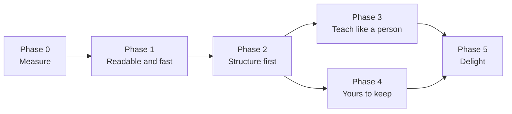

# Whiteboard — implementation phases

Plan date: **1 October 2026**, checked against the code on **2 October 2026**. Code baseline: `b2f6fa0` on `guide-mode`.

This file turns the whiteboard research into the order we build it. The research, the evidence behind each problem, and the rationale for each recommendation are in [Kite whiteboard: research and plan to make it mature](https://claude.ai/code/artifact/2d56d024-83cb-43ad-b4cc-31ecf795a476). How the whiteboard works today is in [whiteboard.md](whiteboard.md) and [ADR 013](adr/013-whiteboard.md).

## Start here

The whiteboard's foundation is right: one planned script, speech that leads the drawing, and a kite that holds the pen. It feels unpolished because the model places every shape by pixel, nothing is drawn until the whole lesson is written (about 12 s in the live check), and most text shows at 11–13 px.

Build in this order:

| Phase | Goal | Size | Exit gate |
| --- | --- | --- | --- |
| 0 · Measure | A baseline and a harness, so every change is judged by numbers | M (≈3 days) | Baseline scores for at least 3 providers |
| 1 · Readable and fast | Fix what users notice first, on today's model contract | L (1–2 weeks) | First stroke ≤ 5 s; no overlaps after lint; text ≥ 14 px |
| 2 · Structure first | The model writes structure and narration; code places everything | XL (2–3 weeks) | 90% lint-clean on 3 providers; half the tokens; first stroke ≤ 3 s |
| 3 · Teach like a person | Drawing on the spoken word, emphasis, maths, algorithms, quizzes | L (≈2 weeks) | Word sync ≤ 250 ms; clarity above phase 2 |
| 4 · Yours to keep | Pointing, editing, saved boards, exports, accessibility | L (1–2 weeks) | Exports open in Excalidraw; keyboard walkthrough passes |
| 5 · Delight | Themes, handwriting, video, languages | Ongoing | Chosen by user feedback |

Phases 3 and 4 can run in either order once phase 2 lands. Sizes use the scale in [roadmap-and-pending.md](roadmap-and-pending.md): S = contained change, M = several components, L = substantial subsystem. Here, XL means an architectural change. The day counts are rough estimates for one developer, not dates.

**Decide on merit, not on the dev key.** Choose models, formats and defaults by measured time, size, clarity and user value. The 3-requests-a-minute Kimi key only affects how fast live checks run.

### Rules for every phase

- Ship behind the existing **Settings → Actions → Whiteboard** toggle. Work in progress stays behind a dev flag, never half-visible in a release.
- Keep ADR 013's principles: speech leads and drawing follows, the kite holds the pen, Kite's own renderer, and no approval for drawing on Kite's own board.
- Privacy: a board image sent to a model is Kite's own drawing, never a screen capture. Saved boards stay local. Exports happen only when the user asks.
- Performance targets: layout and lint within 50 ms for 60 elements, with ELK in a worker; no dropped frames while drawing; idle CPU unchanged ([performance](performance/README.md)).
- When a phase lands, update [whiteboard.md](whiteboard.md), [architecture.md](architecture.md), and the harness baseline.

## Phase 0 — Measure

**Goal:** know how good the board is today, on every provider, before changing anything.

- [x] **S · Golden set.** `scripts/board-eval/prompts.json`: about 60 prompts across networking, programming, systems, science and maths (TCP handshake, OAuth, DNS, React rendering, the event loop, git branching, binary search, quicksort, BFS, hash collisions, OSI, CAP, photosynthesis, the water cycle, supply and demand, compound interest, Pythagoras, derivatives, Ohm's law). Each prompt has one or two follow-ups ("simpler", "more detail on the server"). *Done 2 Oct 2026: 60 prompts in 9 topics, each tagged with the diagram family a good answer likely uses.*
- [x] **M · Metrics module.** `src/shared/boardMetrics.ts`, pure and unit-tested. It measures:
  - overlapping area between elements
  - labels overflowing their shape
  - edges through shapes, and edge crossings
  - the smallest on-screen text on a 1080p display. In phase 0 this uses today's framing (`initialFrame()` in `BoardLayer.tsx` and `fitView` in `src/shared/board.ts`). From phase 1 it uses `planCamera`.
  - new elements per beat, words per label, and colors used

  *Done 2 Oct 2026, with two additions: free text lying on a line (for the halo fix), and labels whose words were split to fit their shape (counted as overflow). Each problem lists the elements involved. Tests: `tests/board-metrics.test.cjs`. The default panel size moved to `panelSize()` in `src/shared/board.ts`, so the overlay and the metrics share it.*
- [x] **M · Eval runner.** `scripts/board-eval.cjs`, run in Node. Build it on `scripts/routing-eval.cjs`, which already loads Kite's real system prompt, routing hints and tool definitions in Node through `tests/register.cjs`, and reads keys from `.env`. It runs the lesson path for every configured provider in parallel and records:
  - parse success
  - time to the first lesson token, and total generation time
  - output tokens
  - the metrics above

  It writes `docs/performance/whiteboard/latest.json`.

  *Done 2 Oct 2026: `npm run eval:board`. It shares key loading and the idle voice-turn tool set with `routing-eval.cjs` (`scripts/eval-common.cjs`), and reads the output budget from `voiceOutputTokens` in `agentLoop.ts`. It also records the time to the first complete beat in the stream, which is when phase 1 streaming could start drawing. Rate limits are retried by the harness with a fresh clock per attempt, so a dev key's waits never count as model time. Moonshot and DeepSeek now send token usage in streams (`includeUsage`).*
- [x] **M · Gallery.** `scripts/board-gallery.cjs` (Electron) renders each lesson to PNG through the real renderer (the `test:renderer` path) and writes `docs/performance/whiteboard/index.html`, so runs can be compared by eye. *Done 2 Oct 2026: `npm run eval:board:gallery`. It builds the renderer itself and captures the finished board in the default panel on a 1080p display, in the light theme, as JPEG (about 45 KB each).*
- [x] **S · DeepSeek provider.** Add DeepSeek through the OpenAI-compatible adapter, as Moonshot is added (`src/main/ai/providers.ts`, `src/main/ai/catalog.ts`), marked vision-capable. That way it is scored with the others. *Done 1 Oct 2026 as part of [end-to-end-jobs.md](end-to-end-jobs.md) phase 0; see [models.md](models.md).*
- [x] **S · Lesson log.** Add a dev-panel line per lesson with time to first stroke, tokens, repairs, and lint counts. No lesson content. *Done 2 Oct 2026. The time runs from the model request to the first stroke. `runAgentLoop` reports each model call's tools, invalid inputs and output tokens through `ToolSession.stepDone`, and `BoardService` attaches the stats to every board view and logs them as `board:lesson`.*

**Exit gate:** baseline numbers and a gallery committed for at least three providers.

## Phase 1 — Readable and fast (today's contract)

**Goal:** fix speed, readability and overlaps without changing what the model writes. Each item ships on its own.

- [x] **S · End the turn after a lesson.** In `src/main/ai/agentLoop.ts`, add `hasToolCall('explain_on_whiteboard')` to the existing `stopWhen` array. `BoardService.start` speaks a short local line. This removes a model round trip whose only output is a filler sentence. The same change must also:
  - Skip the `'No action was completed.'` fallback (`agentLoop.ts`, end of `runAgentLoop`) when a lesson started. Otherwise a turn that ends on the tool call with no text speaks that line.
  - Remove "reply with one short sentence such as 'Let me sketch it out.'" from the tool description (`whiteboardDescription` in `src/main/tools/impl/explain_on_whiteboard.ts`) and from both result messages in `BoardService.start`. No reply follows the call any more.

  *Done 2 Oct 2026, as a general rule rather than a whiteboard special case: a tool marked `endsTurn` ends the turn when a real call succeeds (not a dry run or a failure). Nothing is spoken in its place, because a local line would delay beat 1. Beat 1's narration is the answer. The tool result's `transcript` ("(Sketched on the whiteboard: TCP)") is what history records as the reply. The description now asks the model to call the tool straight away, without announcing it.*
- [x] **M · Stream the lesson.** In `runAgentLoop`, handle `tool-input-start` and `tool-input-delta`, parse with `parsePartialJson` (both are in the installed `ai` 7.0.118), and validate each completed beat. Pass beats to the board as they complete, with a new `BoardService.preview(toolCallId, beats)`. The final `tool-call` reconciles by `toolCallId`, so nothing plays twice.
  - `preview` needs a new `BoardSession.append(beats)` that adds beats at the end and lets playback continue. The existing `insert()` is not suitable: it splices beats after the current one, silences speech and restarts from there, which is right for a follow-up but would cut off each streamed beat.
  - The first preview for a `mode: "new"` lesson opens the session (the `start` path). For `mode: "add"`, it places the follow-up once, the way `insert` does, and later beats are appended after it.
  - Tests: beat 1 plays before the call completes; a truncated stream still plays its complete beats; a stream that is then rejected stops cleanly; `mode: "add"` streams after the beat being played.

  *Done 2 Oct 2026. Tools can opt in to streaming (`stream` and `streamEnd` on the definition), and `ToolSession` parses their input as it arrives. A streaming session waits at the newest beat until the next one arrives or the lesson is sealed. With a board open, nothing streams until the model has written `mode`, because a follow-up and a new topic look alike until then.*

  *Two voice changes were needed:*
  - *The controller let narration queue behind the running model turn, so beat 1 still waited for the whole lesson. A lesson line now plays beside a model turn that is still working silently.*
  - *When the model says something before the tool call, that speech is closed as soon as the lesson starts streaming, and narration follows its last words.*

  *Live, on DeepSeek Flash with three prompts: the first stroke came at 1.6–2.6 s from the request, against 3.1–4.2 s for the complete lesson.*
- [x] **S · Repair instead of reject.** Make `lessonInput` lenient, and add `sanitizeLesson()` in `src/shared/board.ts`. It drops unknown references, renames duplicate ids, clamps values, and fills missing labels. The tool result lists the fixes. *Done 2 Oct 2026.*
  - *The schema checks only the shape of values. It keeps types and enums for the model and adds no `default` keywords. A bad optional value is dropped, and an element of an unknown type is left out without losing the rest of its beat.*
  - *Only a lesson with no title, no beats, or a beat without `say` is still rejected.*
  - *`BoardService.start` repairs the lesson against the ids already on the board (a follow-up may point at them) and refuses one with nothing drawable.*
  - *The dev-panel line and the harness count the fixes. The JSON schema sent on every turn is now 1,298 characters.*
- [x] **S · Room for long lessons.** The lesson is written in the first step of an ordinary voice turn, so Kite can't know in advance that a turn is a lesson. Raise `maxOutputTokens` for the whole voice loop in `agentLoop.ts` from 4,096 to 8,192 so long lessons are not cut off. Spoken replies stay short by instruction, so normal turns are unaffected. First check that each provider in `src/main/ai/catalog.ts` accepts 8,192 output tokens, and use the lower limit for any that don't. Phase 2's planner gets its own budget. *Done 2 Oct 2026: `voiceOutputTokens` is 8,192. Every catalog model reachable with the dev keys accepted it: DeepSeek Flash and V4 Pro, GPT OSS 120B and 20B, Kimi K2.6 and K3. Llama 4 Scout, Llama 3.1 8B and Kimi K2.5 answered "model not found" on these keys, so the catalog may need checking.*
- [ ] **M · The real font.** Bundle Excalifont (OFL-1.1) under `assets/fonts/` with its license. Add an `@font-face` in `src/renderer/styles/board.css`. `scripts/font-metrics.cjs` generates `src/shared/boardFont.ts` (glyph advance widths), and `measure()` and `wrapText()` use it, so main and the overlay measure identically. The script needs a font parser such as opentype.js or fontkit, added as a dev dependency.
- [ ] **M · Readable camera.**
  - A bigger default panel in `initialFrame()`: about 1400 × 900 on 1080p, up to 90% of small displays.
  - `planCamera(scene, beat, viewport)` in shared code frames each beat's elements and what they connect to, keeping body text at 14 px or more on screen.
  - The camera glides for 400–600 ms before the first stroke. It pauses when the user pans or zooms (Fit resumes it), and cuts instead of gliding under reduced motion.
  - Add a presentation mode ("make it bigger").
- [ ] **L · Lint and fix today's scenes.** `lintScene()` and `fixScene()` in `src/shared/board.ts`:
  - push overlapping shapes apart along their main axis
  - widen shapes to fit their labels
  - add one elbow to a straight arrow that crosses a shape
  - add a white halo behind labels that sit on lines

  This reduces bad layouts but cannot redesign them; phase 2 fixes the cause.
- [ ] **S · Captions setting.** Hide the caption by default when voice is on (it repeats the narration). Keep it on when voice is off or a screen reader is running.
- [ ] **M · Saved boards.** Add a migration for a `boards` table in `src/main/storage/database.ts` with: id, message id, title, script JSON, final scene JSON, thumbnail PNG, created at. Add FTS on titles and labels. Save when a lesson finishes or closes, and allow reopening from History (a simple list for now). Deleting history deletes its boards. `BoardService.start` receives only the lesson today, so the voice turn's message id has to be passed in, through the tool's execute context or the `explainOnWhiteboard` callback in `src/main/voice/service.ts`.

**Exit gate (harness):**

- Median time to first stroke ≤ 5 s on the fast providers.
- Zero overlaps and zero text overflow after lint on the golden set.
- Smallest on-screen text ≥ 14 px.
- The existing board tests still pass.

## Phase 2 — Structure first

**Goal:** the model says what is on the board, how it connects, and what to say. Code decides where everything goes.

- [ ] **M · Decide the format by measurement.** Build the planner with both the compact line format and coordinate-free JSON for two families (sequence and flow). Run both through the harness, compare tokens, time to first stroke, repair rate and clarity, and keep the winner. Record the decision in **ADR 018**, which replaces the contract part of ADR 013. (ADRs 014–017 are taken.)
- [ ] **S · Small tool on the voice turn.** `explain_on_whiteboard({ topic, focus?, level?, mode })`. Its description and schema shrink from about 4,200 characters, sent on every turn, to a few lines.
- [ ] **L · Board planner.** `src/main/board/planner.ts` is a streaming call with a specialist prompt:
  - the diagram families, with one worked example each
  - the recent conversation
  - the current board, as structure
  - the user's level

  It gets its own model setting (`boardModel`), with the default chosen by the harness.
- [ ] **M · Incremental parser.** `src/shared/boardScript.ts` takes the script line by line (or as partial JSON), repairs what it can, and emits a typed script as each part completes.
- [ ] **XL · Diagram families.** One module per family under `src/shared/board/families/`, each with unit and property tests (random inputs never overlap and never route through shapes). In order of how often they are asked for: sequence, flow, architecture (nested groups and icons), tree, cycle, layers, compare, timeline, and freeform on a coarse grid or with relative placement.
- [ ] **L · ELK layout.** Add elkjs (EPL-2.0; add the notice) and load it lazily in a worker. Use layered and `mrtree` layouts, orthogonal edge routing, nested nodes, and label-aware placement. Keep `@dagrejs/dagre` as the fallback only if bundle size becomes a problem.
- [ ] **M · Stable pictures.**
  - Lay out the finished picture before beat 1; beats only reveal parts of it.
  - Follow-ups pin everything already drawn and place new parts in free space beside what they relate to.
  - An unavoidable relayout animates elements to their new places.
- [ ] **M · Icons.** `scripts/board-icons.cjs` converts about 60 Tabler icons (MIT) into stroke plans at build time, so the pen can draw them: user, laptop, phone, server, database, cloud, lock, key, file, gear, queue, globe, and so on.
- [ ] **S · Old boards still play.** An adapter turns saved phase-1 coordinate lessons into the new script, so history replays keep working.
- [ ] **S · Docs.** ADR 018, `whiteboard.md`, `architecture.md`, and the tool and planner prompts.

**Exit gate (harness):**

- At least 90% of golden prompts are lint-clean on at least three providers.
- Output tokens per lesson are at most half the phase 0 baseline.
- Median time to first stroke ≤ 3 s on the fast providers.

## Phase 3 — Teach like a person

**Goal:** the board feels like someone teaching at a whiteboard.

- [ ] **M · Draw on the word.** Pass Cartesia word timestamps (`src/main/voice/tts.ts`) through the board's `speak` hooks. Each element starts on its cue word: an explicit `cue`, or its label's words in the spoken line. It draws until the next cue. With voice off, use reading-speed timing.
- [ ] **S · No gaps.** Request the next beat's audio while the current beat plays.
- [ ] **L · Emphasis and change.** In `src/renderer/board/player.ts`, add:
  - underline, pulse, and dimming everything else
  - numbered badges and strike-through
  - an eraser motion instead of vanishing
  - animated move and swap
  - value changes that cross out the old value and write the new one
- [ ] **M · The kite as teacher.** Between strokes, the kite points its nose at the element being talked about. On a recap, it circles the parts it names. When it asks a question, it turns toward the user.
- [ ] **L · Algorithms.** A data-structures family (arrays with indices, pointers, stacks, queues, linked lists, hash buckets) whose beats change values, swap, and move pointers.
- [ ] **L · Maths.** A steps family (worked lines with aligned `=` and side notes), with formulas from MathJax's SVG output (Apache-2.0), loaded lazily so the pen traces them. A plot family (axes, curves sampled by a small safe expression parser with no `eval`, points, and shaded areas).
- [ ] **M · Conversation beats.**
  - Recap beats.
  - Optional `ask` beats that wait for a spoken answer, on by default for "teach me" and "quiz me".
  - Planner commands: "simpler", "more detail on X", "give me an example", "summarize".
  - Drill-down child boards with a breadcrumb, and "go back".
- [ ] **S · Playback controls.** Beat dots to jump between beats, "previous", and speed from 0.75× to 1.5×.

**Exit gate (harness):**

- Median word-sync error ≤ 250 ms.
- Dead air between beats ≤ 700 ms.
- Clarity score above phase 2 on every provider.

## Phase 4 — Yours to keep

**Goal:** you can point at the board, change it, find it again, and take it anywhere.

- [ ] **S · The model sees the board.** Follow-ups get the board as structure, plus a PNG for vision models. It is Kite's own drawing, so no capture and no "Kite is looking" indicator.
- [ ] **S · Point without the shortcut.** Clicking an element shows an "Ask about this" chip. Marks made while holding the shortcut keep working.
- [ ] **L · Light editing.**
  - Drag an element (it stays pinned), double-click to edit a label, and delete.
  - A toolbar with pen (perfect-freehand), arrow, text and eraser for the user's own sketch.
  - "Is this right?" sends that sketch as structure plus an image.
- [ ] **M · Boards in History.** Thumbnails, full-text search ("the TCP diagram from yesterday"), and reopen with Replay.
- [ ] **L · Exports.**
  - SVG.
  - Excalidraw: a `.excalidraw` file, and clipboard JSON through the element skeleton mapping. "Open in Excalidraw" pastes with the keyboard only and restores the clipboard.
  - Mermaid, for the flow and sequence families.
  - A PDF handout: the board plus the narration as notes.
- [ ] **M · Accessibility.**
  - An ARIA outline of every element, its label and its connections (build on `describeScene`).
  - Keyboard use: Tab moves between elements, Enter asks about the focused one, Space pauses.
  - The captions setting follows the screen reader.

**Exit gate:**

- Every golden board exported to `.excalidraw` opens on excalidraw.com with its arrows still bound.
- Mermaid exports render on GitHub.
- A keyboard-only walkthrough of a board passes.
- The outline lists every element.

## Phase 5 — Delight

Pick from these by user feedback once phases 3 and 4 are in use:

- [ ] **M · Themes:** paper, chalkboard, blueprint.
- [ ] **M · Handwriting:** short labels written with a single-stroke font, so the pen traces real letters. Long text keeps the clip reveal.
- [ ] **L · Video export:** a WebM replay with narration audio, for sharing a lesson.
- [ ] **M · Languages:** board voice commands beyond English.
- [ ] **M · Background reviewer:** a second model pass that checks later beats while the early ones play. Build it only if the harness shows it improves clarity without delaying the first stroke.
