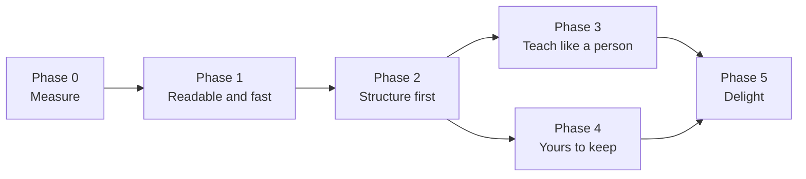

# Whiteboard — implementation phases

Plan date: **1 October 2026**, checked against the code on **8 October 2026**. Code baseline: `7414a02` on `master` (phases 1–3), plus the phase 4 changes in this working tree.

This file turns the whiteboard research into the order we build it. The research, the evidence behind each problem, and the rationale for each recommendation are in [Kite whiteboard: research and plan to make it mature](https://claude.ai/code/artifact/2d56d024-83cb-43ad-b4cc-31ecf795a476). How the whiteboard works today is in [whiteboard.md](whiteboard.md) and [ADR 013](adr/013-whiteboard.md).

## Implementation status — 8 October 2026

**Phase 1 is complete. Phase 2 has 10/10 implementation items; Phase 3 has 8/8; Phase 4 has 6/6.** Phase 2's release latency gate, Phase 3's scored provider-clarity gate and Phase 4's hosted export gates remain pending. Phase 0 has all six implementation items, but its original three-provider baseline gate remains pending. Checked boxes mean the implementation exists; each phase's gate is recorded separately. Development flags are `KITE_BOARD_PHASE2=1`, `KITE_BOARD_PHASE3=1` and `KITE_BOARD_PHASE4=1`. Phase 4 implies phases 2 and 3; `KITE_BOARD_PHASE2=0` disables all extensions. The released default retains the legacy tool.

- **Phase 0 · Measure: 6/6 implemented; exit gate pending.** The 60-prompt golden set, metrics, eval runner, gallery generator, DeepSeek adapter, and lesson log exist. The frozen [baseline](performance/whiteboard/phase0-baseline.json) covers DeepSeek Flash from 2 October. A [gallery of 122 repaired boards](performance/whiteboard/index.html) is now present. The gate still requires baselines and galleries for two additional providers.
- **Phase 1 · Readable and fast: 9/9 implemented; gates passed.** Streaming, turn ending, input repair, the 8,192-token budget, Excalifont, camera/presentation mode, captions, scene repairs, and saved boards are implemented. Repairs preserve existing placements, resize labels, separate collisions, detour obstructed arrows, and halo text on lines. Boards save locally on completion/close with thumbnails, title/label search, History replay, and cascade deletion. The latency log now waits for the renderer's first drawing frame.
- **Phase 2 · Structure first: 10/10 implemented; release gate pending.** The small voice tool delegates to a streaming specialist with its own model setting and coordinate-free script. Nine diagram families, incremental parsing/repair, a lazy ELK worker, 60 drawable icons, pinned follow-ups, saved-board compatibility and [ADR 018](adr/018-structured-whiteboard.md) are implemented. The three-provider lint-clean and half-token gates pass. DeepSeek meets the 3 s first-stroke target; Groq's latest median is 4.01 s, so the new path stays behind the development flag.
- **Phase 3 · Teach like a person: 8/8 implemented; clarity gate pending.** Word-cued drawing and next-beat audio prefetch, emphasis/eraser/value/move/swap animations, teacher gestures, data/steps/plot families, answer-waiting quizzes, child boards, beat navigation and lesson speed are implemented. A real Cartesia fixture measured **19.5 ms median cue error** and **406 ms maximum dead air**. Three targeted JSON probes per provider draw cleanly and sort the test array correctly, but do not establish clarity above Phase 2. See [ADR 019](adr/019-whiteboard-teaching.md).
- **Phase 4 · Yours to keep: 6/6 implemented; hosted export gates pending.** Visual follow-ups use the edited structure and an ephemeral PNG of Kite's own drawing for vision models. Click-to-ask, pinned drag/label/delete edits, undo/redo, pen/arrow/text/eraser, saved edits, SVG/Excalidraw/Mermaid/PDF exports and a complete accessible outline are implemented. The keyboard walkthrough passes. All 314 stored boards load in Excalidraw's SDK with reciprocal arrow bindings; 82 applicable Mermaid exports render locally. Actual all-golden excalidraw.com imports and hosted GitHub rendering remain separate checks. See [ADR 020](adr/020-owned-whiteboard.md).
- **Phase 5 · Delight: 0/5 implemented.** Themes, single-stroke handwriting, video export, multilingual board commands, and the background reviewer remain.

### Verification and remaining gates

Verification on **8 October 2026**:

- Full unit suite: **261/261 passed with `--test-concurrency=1`**. The default parallel suite passed before the final routing assertion was added; its last run hit a timing flake in the existing cart-variant test (`tests/job.test.cjs:250`). The complete serial rerun passed, including that test and all whiteboard tests. The wrapping fixture uses Excalifont widths, and the overflow fixture lays out the actual label it measures. Added coverage for scene repairs, explicit obstacle detours, stable streaming prefixes, archive lifecycle, rejected previews and renderer first-stroke acknowledgements.
- `npm run typecheck`: passed.
- `npm run lint`: passed.
- `npm run test:native`: passed, including migration from the old schema, save/restart/search/update/cascade deletion of boards and late thumbnail callbacks after deletion.
- `npm run test:renderer`: passed, including saved-board Replay and a valid PNG thumbnail no larger than 420 px.
- `npm run eval:board:phase1`: the frozen **60 prompts / 122 lessons / 565 beats** have **zero overlaps and zero label overflow at every beat**, and minimum newly drawn text of **14 px** at its explanation camera. The 60-element layout-and-lint benchmark is under the 50 ms target. Details: [phase1-replay.json](performance/whiteboard/phase1-replay.json).
- `npm run eval:board:live`: fresh first-stroke measurements use the actual 1080p overlay, streaming tool, camera and SVG player, with voice off and ordinary motion. Medians over TCP, OAuth and DNS are **2.80 s on DeepSeek Flash** and **3.77 s on Groq GPT OSS 120B**, both within the 5 s target. These checks exclude TTS startup. Detailed provider samples and conditions: [phase1-live.json](performance/whiteboard/phase1-live.json).
- The [gallery](performance/whiteboard/index.html) renders all **122 boards** through the real renderer.

The old provider generations are preserved in [phase0-baseline.json](performance/whiteboard/phase0-baseline.json). [latest.json](performance/whiteboard/latest.json) revalidates those same generations through today's deterministic repairs; it does **not** claim 122 fresh provider calls. Old token and model-generation timings remain historical. Fresh renderer latency is recorded separately. Finished-board overview text can be smaller than the 14 px explanation-camera target. Some intentional lines still cross shapes and some arrows cross; phase 1's overlap/overflow gate passes, while phase 2's 90% fully lint-clean gate is separate.

### Phase 2 verification — 8 October 2026

- **272/272 unit tests passed serially**, including parser chunk boundaries, malformed/truncated streams, all nine families with 108 randomized diagrams, nested ELK, stable follow-ups, old archives, icons, model selection and the real small-tool → planner → board-service path. The final targeted board run passed 41/41. Type checking, lint, native and renderer smoke tests, and the main production build passed.
- **Three-provider golden gate passed.** The [phase-2 baseline](performance/whiteboard/phase2-golden.json) contains 60 attempts per provider: DeepSeek Flash 60/60 lint-clean, Groq GPT OSS 120B 60/60, Kimi K2.6 58/60 (96.7%; two rate-limit failures retained). All 178 playable lessons and 788 revealed beats are clean. Here, clean means zero overlaps, label overflow, edges through unrelated shapes and unprotected text on lines; crossings remain separately reported. The [178-board gallery](performance/whiteboard/phase2/index.html) renders the compiled lessons through the actual overlay.
- **Half-token gate passed.** Median planner output is 234.5/275/248.5 tokens respectively, against the frozen phase-0 DeepSeek reference of 1,112. Fresh live combined routing-plus-planner medians are 341 tokens on DeepSeek and 498 on Groq, both below 556. The original phase-0 provider-specific baselines are still incomplete.
- **Layout target passed warm.** The [60-element benchmark](performance/whiteboard/phase2-layout.json) records a 29.83 ms median and 35.78 ms maximum over ten fixed warm samples. Cold worker startup plus layout is 169.34 ms and is included in live first stroke.
- **First-stroke release gate pending.** [Fresh live measurements](performance/whiteboard/phase2-live.json), including the small voice call, specialist, worker, font, camera and pen, give medians of **2.85 s DeepSeek / 4.01 s Groq** across TCP, OAuth and DNS. Voice is off and motion is ordinary; TTS startup is excluded. A GPT OSS 20B probe did not draw. The ≤3 s target does not pass across the checked fast providers.
- **Measured format decision:** [lines versus JSON](performance/whiteboard/phase2-format-decision.json) covers sequence and flow on all three providers, with a separately recorded [rate-limit retry](performance/whiteboard/phase2-format-retry.json). Lines use fewer tokens and generally reach a completed beat sooner; see ADR 018 for sample sizes, manual clarity findings and the distinction between readiness and renderer first stroke.

The phase-2 reports preserve original provider timings/tokens and recompile their stored scripts through the current deterministic layout. Later prompt corrections are recorded in ADR 018; these reports do not claim that all 180 calls were repeated after each prompt change. Full live provider follow-up and semantic-accuracy scores remain future evaluation work. The phase-1 `latest.json` baseline remains intact while phase 2 is opt-in.

**Next:** reduce the complete Groq routing/planning/drawing path below the 3 s median gate, then enable the phase-2 default. Finish the separate historical phase-0 baseline gate before calling every earlier phase closed.

### Phase 3 verification — 8 October 2026

- **281/281 unit tests passed serially**, including nine teaching tests for streaming metadata, safe expressions, real MathJax worker paths, equation columns/side notes, stable indices and swaps, question waits, playback controls, stale callbacks, silent prefetch adoption and child-board restoration. Type checking, lint and main/renderer production builds passed. Native smoke covers the real Electron formula worker. Renderer smoke passed, including cue onset, simultaneous swaps and bound arrows, old-value erasure, effects, formula paths and controls. Two earlier full renderer runs hit existing kite-animation timing assertions; the isolated rerun passed.
- **Local layout fixtures:** [five boards / 16 beats](performance/whiteboard/phase3-fixtures.json), all lint-clean at every beat. The [14-board gallery](performance/whiteboard/phase3/index.html) adds nine fresh provider probes. Finished-board overview images are not timing measurements.
- **Live timing fixture passed:** [phase3-live.json](performance/whiteboard/phase3-live.json) uses the real 1080p offscreen overlay, Cartesia sonic-3.5 and actual Web Audio scheduling, with speaker output muted and ordinary motion. Six element cues across three fully known beats have **19.5 ms median error**; the two gaps are **406 ms and 351 ms**. Expected onset comes from final provider word timestamps, not estimated narration. This is one fixture sample; it does not cover all voices, speeds, networks or pauses while a planner is still generating the next beat. The harness waits for voice/board listeners before sending events; its initial startup attempt did not complete and is not counted as a timing pass.
- **Synthetic renderer timing:** [phase3-renderer.json](performance/whiteboard/phase3-renderer.json) separately records onset against a supplied local cue schedule. It exercises swap/arrow animation and erasure without claiming provider word accuracy.
- **Provider capability probes:** [the final JSON run](performance/whiteboard/phase3-provider-probe.json) covers an array quiz, worked equations and a shaded parabola on DeepSeek Flash, Groq GPT OSS 120B and Kimi K2.6. All nine lessons are lint-clean; all three array lessons emit real swaps, end at `[3, 5, 7]`, and include an `ask` pause. Formula and plotted-point metadata are present. Earlier line probes are retained separately; some described changes without emitting them or used the wrong node identities. The prompt now explains stable identities and actual action fields. Phase 3 defaults to JSON for its nested metadata; Phase 2 retains lines. These are targeted probes with prompt revisions, not a controlled format comparison or full golden set.
- **Release gate remains pending:** no scored human comparison establishes clarity above Phase 2 on every provider. Timing passes the recorded fixture scope, but cannot establish that clarity gate. Phase 3 remains opt-in; enabling it implies Phase 2 unless `KITE_BOARD_PHASE2=0` explicitly disables the structured path.

### Phase 4 verification — 8 October 2026

- **297/297 unit tests passed serially**, including 16 new tests for input validation, pin/replay/undo behavior, cascade deletion, user strokes, archive reopening, stale/cancelled images, typed questions without microphone or screen capture, complete outlines, safe exports, specialist image context and the sandboxed keyboard-paste/clipboard transaction. Type checking, lint, Forge production main/preload builds, renderer build, bundled startup, native smoke, clipboard restoration and the existing renderer smoke passed. An earlier run failed the existing Balanced checkout permissions test; that file passed alone and the complete rerun passed. No permissions code changed. The final invalid-edit planning guard also passed the 36-test board/script/teaching subset.
- **Excalidraw compatibility:** [the native report](performance/whiteboard/phase4-verification.json) imports all **314 stored playable boards** through `loadFromBlob` in SDK 0.18.1 and restores the clipboard elements with binding repair. It checks every element id, formula file, **1,340 arrows and 2,160 endpoint bindings**, including reciprocal references. Sources are the 122 Phase 1 lessons, 178 Phase 2 lessons, five teaching fixtures and nine provider probes. This is an SDK check, not a claim of 314 imports on the hosted website. Formulae become embedded SVG images with TeX metadata; shape icons are omitted from the editable mapping. SVG/PDF retain the drawn icons.
- **Mermaid compatibility:** all **82 applicable flow/sequence scenes** render with Mermaid 12.1.0. Exports are fenced `.md` files, with escaped labels and sequence message order preserved. Mermaid represents the structured diagram; freehand ink is retained by the other formats. Hosted GitHub rendering is not yet verified.
- **Actual renderer editing and keyboard walkthrough:** native Chromium Tab moves from Client to Server; Enter asks once about the focused element; Space toggles playback; F2 edits a label and Delete removes a node and its bound arrow. Drag pinning, Ctrl+Z/Ctrl+Shift+Z, pen, text, arrow, sketch questions, own-image requests and SVG export pass through the renderer/preload/service fixture. The outline has one entry for every visible element. [Editor screenshot](performance/whiteboard/phase4/editor.png).
- **Handout and visual exports:** [edited SVG](performance/whiteboard/phase4/edited-board.svg), [PNG](performance/whiteboard/phase4/edited-board.png) and [two-page PDF](performance/whiteboard/phase4/handout.pdf) are retained. Poppler rendering and PDF text extraction verify the board page and all three notes. Visual review found and fixed missing label pixels caused by embedded font subsets without Unicode ranges; the harness now checks real ink inside the exported Client label. Export filenames are created exclusively, preserving earlier exports. The shared clipboard helper restores text and image payloads in the native clipboard test; hosted Excalidraw keyboard import remains part of the online gate.

Reproduce with `npm run eval:board:phase4`. The editor SDK and Mermaid are development-only validation dependencies. Keep `KITE_BOARD_PHASE4=1` opt-in until the hosted export checks and earlier rollout gates are satisfied.

## Start here

The whiteboard's foundation is right: one planned script, speech that leads the drawing, and a kite that holds the pen. Streaming starts lessons before the model finishes, Excalifont and the beat camera keep explanations readable, and local scene repairs remove collisions and overflow. The released path still uses model coordinates; the opt-in phase-2 path replaces that contract with structure and diagram families. The original latency and text-size observations are historical, not measurements of this implementation.

Build in this order:

| Phase | Goal | Size | Exit gate |
| --- | --- | --- | --- |
| 0 · Measure | A baseline and a harness, so every change is judged by numbers | M (≈3 days) | Baseline scores for at least 3 providers |
| 1 · Readable and fast | Fix what users notice first, on today's model contract | L (1–2 weeks) | First stroke ≤ 5 s; no overlaps after lint; text ≥ 14 px |
| 2 · Structure first | The model writes structure and narration; code places everything | XL (2–3 weeks) | 90% lint-clean on 3 providers; half the tokens; first stroke ≤ 3 s |
| 3 · Teach like a person | Drawing on the spoken word, emphasis, maths, algorithms, quizzes | L (≈2 weeks) | Word sync ≤ 250 ms; clarity above phase 2 |
| 4 · Yours to keep | Pointing, editing, saved boards, exports, accessibility | L (1–2 weeks) | Exports open in Excalidraw; keyboard walkthrough passes |
| 5 · Delight | Themes, handwriting, video, languages | Ongoing | Chosen by user feedback |

Phases 3 and 4 can run in either order once phase 2 lands. Sizes use the scale in [roadmap-and-pending.md](roadmap-and-pending.md): S = contained change, M = several components, L = substantial subsystem. Here, XL means an architectural change. The day counts are rough estimates for one developer, not dates.

**Decide on merit, not on the dev key.** Choose models, formats and defaults by measured time, size, clarity and user value. The 3-requests-a-minute Kimi key only affects how fast live checks run.

### Rules for every phase

- Ship behind the existing **Settings → Actions → Whiteboard** toggle. Work in progress stays behind a dev flag, never half-visible in a release.
- Keep ADR 013's principles: speech leads and drawing follows, the kite holds the pen, Kite's own renderer, and no approval for drawing on Kite's own board.
- Privacy: a board image sent to a model is Kite's own drawing, never a screen capture. Saved boards stay local. Exports happen only when the user asks.
- Performance targets: layout and lint within 50 ms for 60 elements, with ELK in a worker; no dropped frames while drawing; idle CPU unchanged ([performance](performance/README.md)).
- When a phase lands, update [whiteboard.md](whiteboard.md), [architecture.md](architecture.md), and the harness baseline.

## Phase 0 — Measure

**Goal:** know how good the board is today, on every provider, before changing anything.

- [x] **S · Golden set.** `scripts/board-eval/prompts.json`: about 60 prompts across networking, programming, systems, science and maths (TCP handshake, OAuth, DNS, React rendering, the event loop, git branching, binary search, quicksort, BFS, hash collisions, OSI, CAP, photosynthesis, the water cycle, supply and demand, compound interest, Pythagoras, derivatives, Ohm's law). Each prompt has one or two follow-ups ("simpler", "more detail on the server"). *Done 2 Oct 2026: 60 prompts in 9 topics, each tagged with the diagram family a good answer likely uses.*
- [x] **M · Metrics module.** `src/shared/boardMetrics.ts`, pure and unit-tested. It measures:
  - overlapping area between elements
  - labels overflowing their shape
  - edges through shapes, and edge crossings
  - the smallest on-screen text on a 1080p display. In phase 0 this uses today's framing (`initialFrame()` in `BoardLayer.tsx` and `fitView` in `src/shared/board.ts`). From phase 1 it uses `planCamera`.
  - new elements per beat, words per label, and colors used

  *Done 2 Oct 2026, with two additions: free text lying on a line (for the halo fix), and labels whose words were split to fit their shape (counted as overflow). Each problem lists the elements involved. Tests: `tests/board-metrics.test.cjs`. The default panel size moved to `panelSize()` in `src/shared/board.ts`, so the overlay and the metrics share it.*
- [x] **M · Eval runner.** `scripts/board-eval.cjs`, run in Node. Build it on `scripts/routing-eval.cjs`, which already loads Kite's real system prompt, routing hints and tool definitions in Node through `tests/register.cjs`, and reads keys from `.env`. It runs the lesson path for every configured provider in parallel and records:
  - parse success
  - time to the first lesson token, and total generation time
  - output tokens
  - the metrics above

  It writes `docs/performance/whiteboard/latest.json`.

  *Done 2 Oct 2026: `npm run eval:board`. It shares key loading and the idle voice-turn tool set with `routing-eval.cjs` (`scripts/eval-common.cjs`), and reads the output budget from `voiceOutputTokens` in `agentLoop.ts`. It also records the time to the first complete beat in the stream, which is when phase 1 streaming could start drawing. Rate limits are retried by the harness with a fresh clock per attempt, so a dev key's waits never count as model time. Moonshot and DeepSeek now send token usage in streams (`includeUsage`).*
- [x] **M · Gallery.** `scripts/board-gallery.cjs` (Electron) renders each lesson to PNG through the real renderer (the `test:renderer` path) and writes `docs/performance/whiteboard/index.html`, so runs can be compared by eye. *Done 2 Oct 2026: `npm run eval:board:gallery`. It builds the renderer itself and captures the finished board in the default panel on a 1080p display, in the light theme, as JPEG (about 45 KB each).*
- [x] **S · DeepSeek provider.** Add DeepSeek through the OpenAI-compatible adapter, as Moonshot is added (`src/main/ai/providers.ts`, `src/main/ai/catalog.ts`), marked vision-capable. That way it is scored with the others. *Done 1 Oct 2026 as part of [end-to-end-jobs.md](end-to-end-jobs.md) phase 0; see [models.md](models.md).*
- [x] **S · Lesson log.** Add a dev-panel line per lesson with time to first stroke, tokens, repairs, and lint counts. No lesson content. *Done 2 Oct 2026. The time runs from the model request to the first stroke. `runAgentLoop` reports each model call's tools, invalid inputs and output tokens through `ToolSession.stepDone`, and `BoardService` attaches the stats to every board view and logs them as `board:lesson`.*

**Exit gate:** baseline numbers and a gallery committed for at least three providers.

**Gate status (8 Oct): pending.** All six implementation items exist and the DeepSeek gallery is present, but the original coordinate-contract baseline/gallery covers only one provider. Phase 2 now has three-provider structured-script results; those do not backfill the missing historical phase-0 controls.

## Phase 1 — Readable and fast (today's contract)

**Goal:** fix speed, readability and overlaps without changing what the model writes. Each item ships on its own.

- [x] **S · End the turn after a lesson.** In `src/main/ai/agentLoop.ts`, add `hasToolCall('explain_on_whiteboard')` to the existing `stopWhen` array. `BoardService.start` speaks a short local line. This removes a model round trip whose only output is a filler sentence. The same change must also:
  - Skip the `'No action was completed.'` fallback (`agentLoop.ts`, end of `runAgentLoop`) when a lesson started. Otherwise a turn that ends on the tool call with no text speaks that line.
  - Remove "reply with one short sentence such as 'Let me sketch it out.'" from the tool description (`whiteboardDescription` in `src/main/tools/impl/explain_on_whiteboard.ts`) and from both result messages in `BoardService.start`. No reply follows the call any more.

  *Done 2 Oct 2026, as a general rule rather than a whiteboard special case: a tool marked `endsTurn` ends the turn when a real call succeeds (not a dry run or a failure). Nothing is spoken in its place, because a local line would delay beat 1. Beat 1's narration is the answer. The tool result's `transcript` ("(Sketched on the whiteboard: TCP)") is what history records as the reply. The description now asks the model to call the tool straight away, without announcing it.*
- [x] **M · Stream the lesson.** In `runAgentLoop`, handle `tool-input-start` and `tool-input-delta`, parse with `parsePartialJson` (both are in the installed `ai` 7.0.118), and validate each completed beat. Pass beats to the board as they complete, with a new `BoardService.preview(toolCallId, beats)`. The final `tool-call` reconciles by `toolCallId`, so nothing plays twice.
  - `preview` needs a new `BoardSession.append(beats)` that adds beats at the end and lets playback continue. The existing `insert()` is not suitable: it splices beats after the current one, silences speech and restarts from there, which is right for a follow-up but would cut off each streamed beat.
  - The first preview for a `mode: "new"` lesson opens the session (the `start` path). For `mode: "add"`, it places the follow-up once, the way `insert` does, and later beats are appended after it.
  - Tests: beat 1 plays before the call completes; a truncated stream still plays its complete beats; a stream that is then rejected stops cleanly; `mode: "add"` streams after the beat being played.

  *Done 2 Oct 2026. Tools can opt in to streaming (`stream` and `streamEnd` on the definition), and `ToolSession` parses their input as it arrives. A streaming session waits at the newest beat until the next one arrives or the lesson is sealed. With a board open, nothing streams until the model has written `mode`, because a follow-up and a new topic look alike until then.*

  *Two voice changes were needed:*
  - *The controller let narration queue behind the running model turn, so beat 1 still waited for the whole lesson. A lesson line now plays beside a model turn that is still working silently.*
  - *When the model says something before the tool call, that speech is closed as soon as the lesson starts streaming, and narration follows its last words.*

  *Live, on DeepSeek Flash with three prompts: the first stroke came at 1.6–2.6 s from the request, against 3.1–4.2 s for the complete lesson.*
- [x] **S · Repair instead of reject.** Make `lessonInput` lenient, and add `sanitizeLesson()` in `src/shared/board.ts`. It drops unknown references, renames duplicate ids, clamps values, and fills missing labels. The tool result lists the fixes. *Done 2 Oct 2026.*
  - *The schema checks only the shape of values. It keeps types and enums for the model and adds no `default` keywords. A bad optional value is dropped, and an element of an unknown type is left out without losing the rest of its beat.*
  - *Only a lesson with no title, no beats, or a beat without `say` is still rejected.*
  - *`BoardService.start` repairs the lesson against the ids already on the board (a follow-up may point at them) and refuses one with nothing drawable.*
  - *The dev-panel line and the harness count the fixes. The JSON schema sent on every turn is now 1,298 characters.*
- [x] **S · Room for long lessons.** The lesson is written in the first step of an ordinary voice turn, so Kite can't know in advance that a turn is a lesson. Raise `maxOutputTokens` for the whole voice loop in `agentLoop.ts` from 4,096 to 8,192 so long lessons are not cut off. Spoken replies stay short by instruction, so normal turns are unaffected. First check that each provider in `src/main/ai/catalog.ts` accepts 8,192 output tokens, and use the lower limit for any that don't. Phase 2's planner gets its own budget. *Done 2 Oct 2026: `voiceOutputTokens` is 8,192. Every catalog model reachable with the dev keys accepted it: DeepSeek Flash and V4 Pro, GPT OSS 120B and 20B, Kimi K2.6 and K3. Llama 4 Scout, Llama 3.1 8B and Kimi K2.5 answered "model not found" on these keys, so the catalog may need checking.*
- [x] **M · The real font.** Excalifont (OFL-1.1) is bundled under `assets/fonts/excalifont/` with its license and loaded by `@font-face` in `src/renderer/styles/board.css`. `scripts/font-metrics.cjs` generates `src/shared/boardFont.ts` (glyph advance widths), and `measure()` and `wrapText()` use it, so main and the overlay measure identically. *Verified 8 Oct 2026: the generator measures the font with Chromium via Electron (`npx electron scripts/font-metrics.cjs`), so no font-parser dependency was needed. PNG export embeds the font; wrapping/overflow fixtures now pass with these widths.*
- [x] **M · Readable camera.**
  - A bigger default panel in `initialFrame()`: about 1400 × 900 on 1080p, up to 90% of small displays.
  - `planCamera(scene, beat, viewport)` in shared code frames each beat's elements and what they connect to, keeping body text at 14 px or more on screen.
  - The camera glides for 400–600 ms before the first stroke. It pauses when the user pans or zooms (Fit resumes it), and cuts instead of gliding under reduced motion.
  - Add a presentation mode ("make it bigger").

  *Verified 8 Oct 2026: `panelSize()` uses 1400 × 900 on 1080p, capped at 90% on smaller displays; `planCamera()` frames each beat and its connected elements at a scale targeting 14 px text. `BoardLayer.tsx` glides for 500 ms before the pen starts, holds manual pan/zoom until Fit, and cuts under reduced motion. The Bigger/Smaller button and local voice commands toggle presentation mode. `lessonMetrics()` measures text at each beat's camera and records finished-board overview text separately; the overview can still be below 14 px. All 122 stored golden lessons pass the explanation-camera text target.*
- [x] **L · Lint and fix today's scenes.** `lintScene()` and `fixScene()` exported from `src/shared/board.ts` (implemented in `boardLayout.ts`):
  - push overlapping shapes apart along their main axis
  - widen shapes to fit their labels
  - add one elbow to a straight arrow that crosses a shape
  - add a white halo behind labels that sit on lines

  This reduces bad layouts but cannot redesign them; phase 2 fixes the cause.

  *Done 8 Oct 2026: deterministic `repairBeats()` runs as complete beats enter `BoardSession`, pins the prefix, sizes labels using Excalifont, moves colliding shapes/text/arrow labels, routes arrows with an elbow or detour while retaining bindings, and adds a paper halo to text on lines. The same repaired coordinates feed rendering, model context, metrics, archives and replay. Repairs are idempotent across all 122 stored lessons. The dev log counts scene-adjusted beats and the tool result reports layout fixes.*
- [x] **S · Captions setting.** Hide the caption by default when voice is on (it repeats the narration). Keep it on when voice is off or a screen reader is running. *Verified 8 Oct 2026: `boardCaptions` defaults to false, has a Settings switch, and `src/main/voice/service.ts` enables captions when voice is disabled, no voice is selected, or Electron reports accessibility support. Accessibility changes refresh the board; visually hidden narration remains available to screen readers.*
- [x] **M · Saved boards.** *Done 8 Oct 2026:* the `boards` migration stores id, message id, title, script JSON, scene JSON, thumbnail PNG and created-at time, with FTS on titles/labels. The voice tool passes the originating message id into both streaming previews and final execution. The service saves completed or closed lessons, including streamed/follow-up beats, under one archive id; repeated refreshes do not rewrite an unchanged snapshot. The renderer supplies a 420 px PNG thumbnail. History lists/searches boards and reopens them with Replay. Message deletion cascades to boards and their FTS entries; delayed saves/thumbnails cannot recreate deleted history. Demo/rejected-preview boards are not archived. PNG Save remains an explicit export.

**Exit gate (harness):**

- Median time to first stroke ≤ 5 s on the fast providers.
- Zero overlaps and zero text overflow after lint on the golden set.
- Smallest on-screen text ≥ 14 px.
- The existing board tests still pass.

**Gate status (8 Oct): passed.** All nine items are implemented; the stored golden corpus passes repairs/readability at every beat, live overlay latency meets the 5 s median target on the checked fast providers, and unit/native/renderer/type checks pass. See the evidence and measurement conditions above.

## Phase 2 — Structure first

**Goal:** the model says what is on the board, how it connects, and what to say. Code decides where everything goes.

- [x] **M · Decide the format by measurement.** Build the planner with both the compact line format and coordinate-free JSON for two families (sequence and flow). Run both through the harness, compare tokens, time to first stroke, repair rate and clarity, and keep the winner. Record the decision in **ADR 018**, which replaces the contract part of ADR 013. (ADRs 014–017 are taken.)
- [x] **S · Small tool on the voice turn.** `explain_on_whiteboard({ topic, focus?, level?, mode })`. Its description and schema shrink from about 4,200 characters, sent on every turn, to a few lines.
- [x] **L · Board planner.** `src/main/board/planner.ts` is a streaming call with a specialist prompt:
  - the diagram families, with one worked example each
  - the recent conversation
  - the current board, as structure
  - the user's level

  It gets its own model setting (`boardModel`), with the default chosen by the harness.
- [x] **M · Incremental parser.** `src/shared/boardScript.ts` takes the script line by line (or as partial JSON), repairs what it can, and emits a typed script as each part completes.
- [x] **XL · Diagram families.** One module per family under `src/shared/board/families/`, each with unit and property tests (random inputs never overlap and never route through shapes). In order of how often they are asked for: sequence, flow, architecture (nested groups and icons), tree, cycle, layers, compare, timeline, and freeform on a coarse grid or with relative placement.
- [x] **L · ELK layout.** Add elkjs (EPL-2.0; add the notice) and load it lazily in a worker. Use layered and `mrtree` layouts, orthogonal edge routing, nested nodes, and label-aware placement. Keep `@dagrejs/dagre` as the fallback only if bundle size becomes a problem.
- [x] **M · Stable pictures.**
  - Lay out the finished picture before beat 1; beats only reveal parts of it.
  - Follow-ups pin everything already drawn and place new parts in free space beside what they relate to.
  - The implemented append-only policy reserves the full original graph and avoids relayout. Move animation is not implemented; it is required if later editing permits existing placements to change.
- [x] **M · Icons.** `scripts/board-icons.cjs` converts about 60 Tabler icons (MIT) into stroke plans at build time, so the pen can draw them: user, laptop, phone, server, database, cloud, lock, key, file, gear, queue, globe, and so on.
- [x] **S · Old boards still play.** An adapter turns saved phase-1 coordinate lessons into the new script, so history replays keep working.
- [x] **S · Docs.** ADR 018, `whiteboard.md`, `architecture.md`, and the tool and planner prompts.

*Implemented 8 Oct 2026: lines chosen after paired sequence/flow comparisons; small tool, 4,096-token specialist with model picker, typed parser, nine family modules and randomized checks, measured ELK worker/fallback, stable reveal/follow-up compilation, 60 Tabler point paths, version-1 archive adapter and ADR 018. See the verification section for evidence and limitations.*

**Exit gate (harness):**

- At least 90% of golden prompts are lint-clean on at least three providers.
- Output tokens per lesson are at most half the phase 0 baseline.
- Median time to first stroke ≤ 3 s on the fast providers.

**Gate status (8 Oct): pending.** Three-provider lint cleanliness and half-token checks pass. DeepSeek passes the 3 s median first-stroke target, while Groq is at 4.01 s. Phase 2 stays opt-in until that remaining gate passes.

## Phase 3 — Teach like a person

**Goal:** the board feels like someone teaching at a whiteboard.

- [x] **M · Draw on the word.** Cartesia timestamp batches and playback ids now reach the session and renderer. Explicit phrase cues or spoken label matches drive onset from the Web Audio clock; voice-off playback uses speed-adjusted reading timing. Phase-3 camera cuts avoid delaying cue onset with the legacy camera glide.
- [x] **S · No gaps.** Request one known next beat's audio while the current beat plays. Its bounded PCM/timestamp cache stays silent until adoption; pause, skip, mute, close, speed and cancellation discard stale work. Question beats do not prefetch their answer.
- [x] **L · Emphasis and change.** `src/renderer/board/player.ts` and `BoardLayer.tsx` now support:
  - underline, pulse, and dimming everything else
  - numbered badges and strike-through
  - an eraser motion instead of vanishing
  - animated move and swap
  - value changes that cross out the old value and write the new one
- [x] **M · The kite as teacher.** Between strokes, the kite aims at the current spoken cue. Recaps cycle through highlighted parts, and answer-waiting questions turn it toward the cursor/user.
- [x] **L · Algorithms.** The data family supports arrays with fixed slot indices, pointers, stacks, queues, linked lists and hash buckets. Equal measured slots reserve future value sizes; beats update values, swap identities or move pointers while retargeting bound arrows.
- [x] **L · Maths.** The steps family aligns equation columns and side notes, tracing paths from lazy MathJax 4 SVG conversion in a worker. The plot family draws axes, bounded sampled curves, points and shaded areas through a small expression parser with no `eval`. Invalid expressions are visible errors; unavailable formula conversion falls back to readable text.
- [x] **M · Conversation beats.**
  - Recap beats.
  - Optional `ask` beats that wait for a spoken answer, on by default for "teach me" and "quiz me".
  - Planner commands: "simpler", "more detail on X", "give me an example", "summarize".
  - Drill-down child boards with a breadcrumb, and "go back".
- [x] **S · Playback controls.** Beat buttons jump between reconstructed scenes; Previous/"previous" goes back one beat. Lesson speed supports 0.75×, 1×, 1.25× and 1.5×, plus "slower"/"faster". Child boards have Go back and breadcrumbs; parents retain their scene and archive identity.

**Exit gate (harness):**

- Median word-sync error ≤ 250 ms.
- Dead air between beats ≤ 700 ms.
- Clarity score above phase 2 on every provider.

**Gate status (8 Oct): timing passed on the recorded live fixture; release pending.** Six cues have a 19.5 ms median error and both between-beat gaps are below 700 ms. A scored provider-by-provider clarity comparison is still missing. Keep `KITE_BOARD_PHASE3=1` opt-in; the existing Phase 2 rollout gate remains separate.

## Phase 4 — Yours to keep

**Goal:** you can point at the board, change it, find it again, and take it anywhere.

- [x] **S · The model sees the board.** Follow-ups get the current edited structure, plus a revision-checked PNG for vision models. The PNG comes from Kite's SVG, uses no screen capture/indicator and is not retained in conversation history.
- [x] **S · Point without the shortcut.** Clicking an element shows an "Ask about this" chip with a text question. Marks made while holding the shortcut keep working.
- [x] **L · Light editing.**
  - Drag an element (it stays pinned), double-click to edit a label, and delete.
  - A toolbar with pen (perfect-freehand), arrow, text and eraser for the user's own sketch.
  - "Is this right?" sends that sketch as structure plus an image.
  - Local edit overrides survive playback, follow-ups, archive reopening and Replay; a bounded undo/redo history is available during the session.
- [x] **M · Boards in History.** Thumbnails, full-text search on titles/labels, and reopen with Replay. *Landed with phase 1 saved-board persistence on 8 Oct 2026. Conversational retrieval such as "the TCP diagram from yesterday" remains future planner work.*
- [x] **L · Exports.**
  - SVG.
  - Excalidraw: a `.excalidraw` file, and clipboard JSON through the element skeleton mapping. "Open in Excalidraw" pastes with the keyboard only and restores the clipboard.
  - Mermaid, for the flow and sequence families.
  - A PDF handout: the board plus the narration as notes.
- [x] **M · Accessibility.**
  - An ARIA outline of every element, its label and its connections (build on `describeScene`).
  - Keyboard use: Tab moves between elements, Enter asks about the focused one, Space pauses.
  - The captions setting follows the screen reader.

**Exit gate:**

- Every golden board exported to `.excalidraw` opens on excalidraw.com with its arrows still bound.
- Mermaid exports render on GitHub.
- A keyboard-only walkthrough of a board passes.
- The outline lists every element.

**Gate status (8 Oct): keyboard and complete-outline checks passed; SDK/parser compatibility passed; hosted checks pending.** The report validates all stored scenes and bindings in Excalidraw's SDK and locally renders applicable Mermaid diagrams. It does not establish all-golden hosted imports or actual GitHub rendering. Phase 4 remains opt-in.

## Phase 5 — Delight

Pick from these by user feedback once phases 3 and 4 are in use:

- [ ] **M · Themes:** paper, chalkboard, blueprint.
- [ ] **M · Handwriting:** short labels written with a single-stroke font, so the pen traces real letters. Long text keeps the clip reveal.
- [ ] **L · Video export:** a WebM replay with narration audio, for sharing a lesson.
- [ ] **M · Languages:** board voice commands beyond English.
- [ ] **M · Background reviewer:** a second model pass that checks later beats while the early ones play. Build it only if the harness shows it improves clarity without delaying the first stroke.
